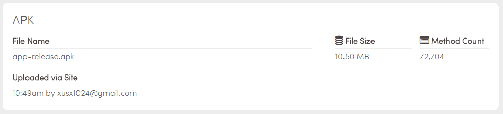
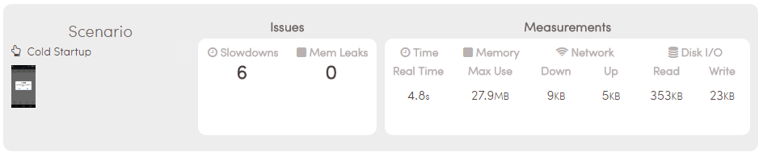
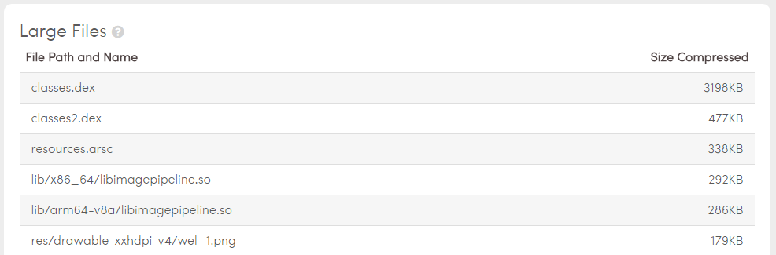
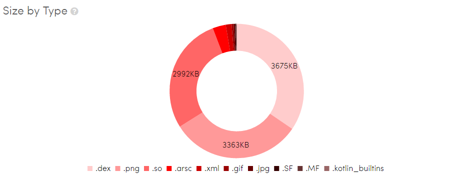
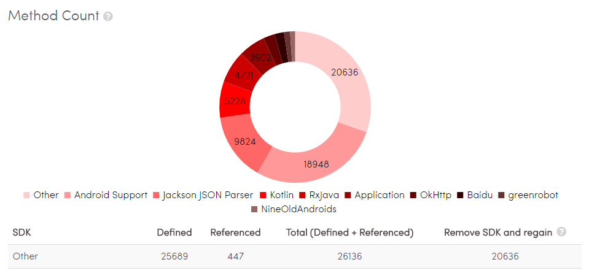
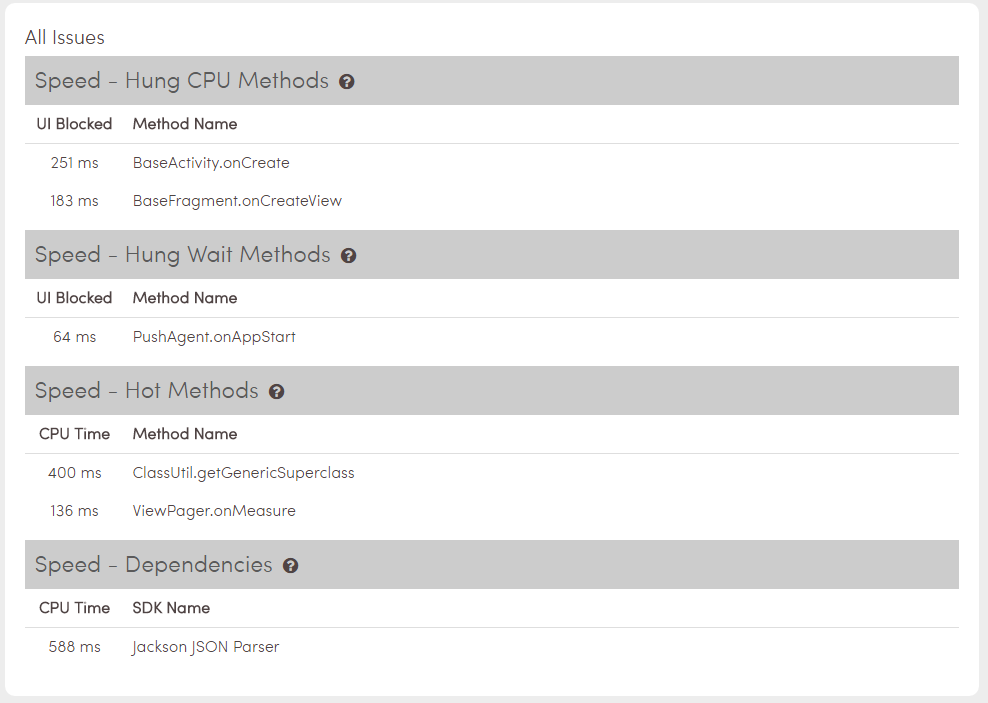
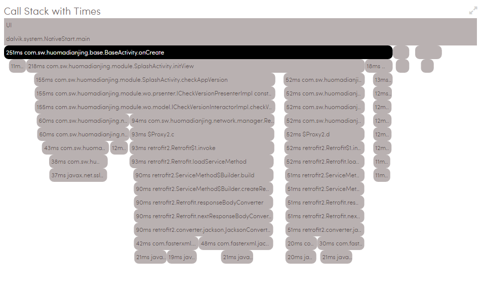
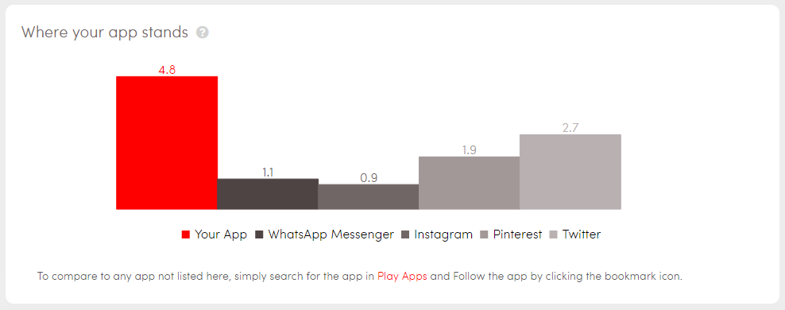

 
#### 在线检测 ####

>在线分析APK：[NimbleDroid](https://nimbledroid.com/)

##### 实例分析-Summary #####

	我们上传一个apk，看看这款App的分析结果。

- File Name 我们上传的App名字
- File Size 文件大小
- Method Count 方法总数
- Uploaded via Site 谁在什么时间上传 

- Scenario：Cold StartUp 冷启动场景下
- Slowdowns 速度减缓的地方
- Merm Leaks 内存泄漏的地方
- Time-Real Time 时间花费
- Memory-Max Use 内存占用
- Network-down 下载数据量
- Network-up 上传数据量
- Disk I/O-Read 从磁盘读取数据量
- Disk I/O-Write 写入磁盘的数据量

##### 实例分析-File Sizes #####

> 在此，我们看到100kb以上的文件。其中某些lib下的多余库，高清大图片是我们关注的重点。

>不同类型的文件所占体积大小。

##### 实例分析-Method Count #####

>各SDK方法数统计。

##### 实例分析-具体Scenario分析 #####

我们考察冷启动从欢迎页启动到主页这个场景。看到时间为`4.8s`,感觉有些长了。我们使用Android Monitor的日志，过滤`ActivityManager:Displayed`，看到欢迎页是`569ms`，主页是`613ms`。

如图：

- Speed - Hung CPU Methods 挂起CPU方法使UI落后，反应延迟。对用户来说是长于32ms。方法在该条目下因为此时正在使用CPU。
- Speed - Hung Wait Methods 挂起CPU方法使UI落后，反应延迟。对用户来说是长于32ms。方法在此条目下因为正在等待可用的资源，尽管没有使用CPU。
- Speed - Hot Methods 热方法即执行其调用的CPU时间长于100ms。
- Speed - Dependencies 有时应用中的依赖关系会影响性能。

- BaseActivity、BaseFragment的初始化操作
- PushAgent.onAppStart 推送服务启动
- ClassUtil.getGenericSuperclass fastjson的方法
- ViewPager.onMeasure 欢迎页的测量
- Jackson JSON Parser jackjson的解析
 
我们选取一个方法点击进入详细，如图：

在此我们可以看到，Umeng推送，百度定位，检查版本更新，检查热修复包版本，retrofitmanager初始化。

> 看到这个对比图，还是老脸微红的。现在的SDK都要求在Application里初始化，搞的定位，推送，热修复，网络框架，图片框架都在这里了，皮，真的皮！

#### 优化注意点 ####

##### 资源 #####

- 清除未使用的资源，Android lint analyze & shrinkResource
- 大图片使用tinyPNG
- png转webp
- [AndResGuard](https://github.com/shwenzhang/AndResGuard)

##### 第三方库 #####
	
- 清除不必须的第三方jar，尤其是Android support 

##### 冗余代码 #####

- inspect code