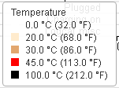

#### 目录 ####

- 如何收集数据
- 数据图表的含义
- 如何分析并优化

#### 收集数据 ####

- 手机连接USB,执行`adb shell dumpsys batterystats --reset`命令,清空电池的历史状态
- 断开USB,打开目标应用,正常使用5分钟左右
- 连接USB,执行`adb bugreport bugreport.zip`,可以到处zip文件到当前目录下
- 浏览器进入`Battery Historian`,上传已生成的zip,然后会自动生成分析图表文件.

	其实在收集数据时候,我们应该尽量正常使用手机,然后打开几个友商App,大概使用个10分钟左右,导出数据,先看系统电量状态,然后看这几个友商app的耗电情况,然后对比自家产品,看看可以优化的地方在哪里.

关于`Battery Historian`的使用:[传送](http://xusx1024.com/2018/01/04/battery-historian/)

#### 图表导览 ####

* 鉴于网上相关博客过多关于`Historian`的说明,我们的重点是新版`Historian V2`

该图各个条目的意思,我们按照各个维度在图片左上右下的顺序来讲述,读者可以对比自己的图表,来查看如下的条目说明:

##### 左 #####
- CPU running: CPU运行,从开始使用app到转储使用信息,CPU是持续耗电的,与之相似的是`Userspace wakelock`,`Screen`
- Kernel only uptime: 仅内核运行时间.即:CPU运行,但是屏幕没有唤醒的情况.产生该维度是用来和`CPU running`,`Userspace wakelock`作比较,不会出现在电量日志记录里
- Userspace wakelock: 一般情况下,设备空闲,屏幕关闭,最后CPU停止运行,wake_lock可以阻止CPU休眠,比如后台持续下载.该维度只记录第一个使用wake_lock的app,如果需要记录所有的,使用`adb shell dumpsys batterystates --enable full-wake-history`
- **Long Wakelocks**: 如果这个维度出现了记录,说明持有wake_lock已经超过1分钟了,这样是极其不正常的
- Screen:屏幕维度
	- 红色:亮屏
	- 白色:息屏
- **Top app**:耗电最高的应用,如果我们专注于使用测试目标app,那么该维度反而没有用了.其实在正常使用手机下测试,该维度很重要.
- **Activity Manager Proc**: 活动管理者进程.在我们示例的图中,该进程被两次调起,一次是应用启动,一次是定位服务启动
- **Crashes(logcat)**:crash耗电信息
- **JobScheduler**: 任务调度器耗电信息
- **SyncManager**:同步管理耗电信息.即账户管理器同步相关的.
- GPS:GPS定位
	- 红色:开
	- 白色:关
- **Bluetooth Scan(logcat)**:蓝牙搜索耗电信息
- BLE scanning:Bluetooth Low Energy,又叫蓝牙4.0,区别于蓝牙3.0和之前的版本.
	- 绿色:开
	- 白色:关
- Mobile signal strength: 手机信号强度
	- 白色:无信号
	- 红色:差
	- 橙色:略微好一些
	- 黄色:好
	- 绿色:棒棒
- WiFi full lock:和wake lock机制相似,此锁是用于wifi的.
	- 绿色:开
	- 白色:关
- WiFi scan: wifi扫描
- Wifi supplicant:WiFi请求状态

- wifi radio:大概就是wifi是否一直连接.表面含义是wifi 广播.
	- 绿色:开
	- 白色:关
- wifi signal strength:wifi信号强度
	- 白色:无信号
	- 红色:差
	- 橙色:略微好一些
	- 黄色:好
	- 绿色:棒棒
- wifi multicast: wifi组播
	- 绿色:开
	- 白色:关
- wifi running:wifi是否一直运行
	- 绿色:开
	- 白色:关
- wifi on:wifi开关是否开启,开启后,如果由于故障,wifi模组不一定运行.
	- 绿色:开
	- 白色:关
- Audio:音频.我测试的app中是没有故意加音效的,但是出现了耗电的现象.
	- 绿色:开
	- 白色:关
- Foreground process:前台进程.
- Package active:活动的包,大概指的是运行中的,在前台的包(app)
- Battery level:统计电量时的耗电量
- Coulomb charge:库伦是电量单位,难道这是电费??
- Temperature:温度

- plugged:插电状态,在充电状态为关的这一段时间,是我们的手机的真实耗电时间
	- 绿色:开
	- 白色:关
- charging on:充电.如果100电量,就是关闭状态了.
	- 绿色:开
	- 白色:关
- Logcat misc:日志杂项.misc. = miscellaneous
- health:电池?手机健康状态?
- Plug:插头
- Voltage:电压
- charging status:充电状态

##### 上 #####

下面几个复选框,可以都试试,控制显示电量条和每个维度的耗电条的

- Add Metrics:增加度量项目
- show bars
- show level summaries
- show line overlay
- show rate of change

##### 右 #####
电量余量
##### 下 #####
东八区上海时间

##### app selection #####

详细数据,都在这个模块里面.读者可以先整体查看`System Stats`里面的数据,然后选定自家的app,看看是不是主因.再根据业务和本文下一个模块的优化建议,斟酌优化.
该功能虽然称为`Historian`,真正的只能有一个粗略的电量统计,在统计过程中,也要耗电.要综合考虑各种情况,慎重优化.

#### 分析,优化建议 ####

耗电大户:

- 屏幕唤醒
- CPU唤醒
- 蜂窝数据
- 传感器

优化建议:

- 对业务要非常熟悉
- 传感器的使用,比如gps,如果业务上非频繁使用并且要求精度不高,那么就在业务上优化定位时机和精度.
- 如果业务上需要有长时间的service,那么要考虑到CPU weak lock,防止后台任务没有完成,但是cpu睡眠,或者任务已经完成,仍然持有weak lock
- 我们也许会在手机充电时,做一些日志上传操作的定时任务,那么注意重试次数和成功后处理,防止用户一夜充电不到80%,然后手机厂商为我们背锅的情况
- 已知屏幕唤醒是耗电大户,原因是屏幕渲染,绘制消耗资源,所以我们在自定义视图,布局的时候,要尽量做到Android性能优化里要求
- 同理,各种优化,平时编码的习惯,都会影响我们脆弱的电量
- 

 