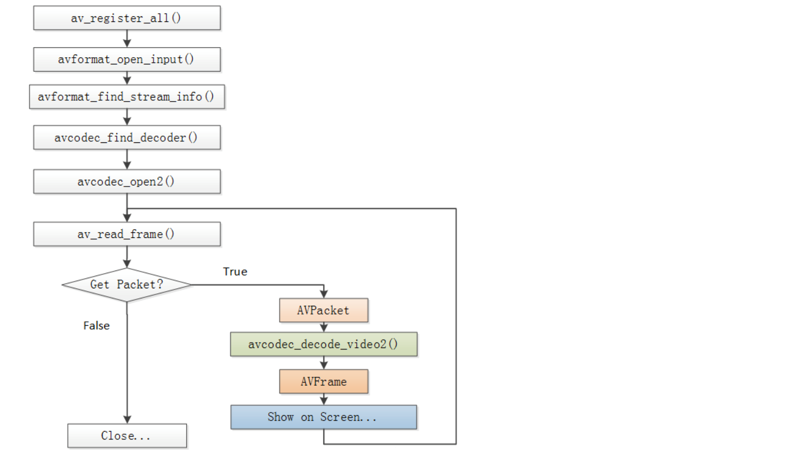

 ### 依赖库功能
  
 |lib|功能|
 |:----:|:----:|
 |avcodec|编解码|
 |avformat|封装格式处理|
 |avfilter|滤镜特效处理|
 |avdevice|各种设备的输入输出|
 |avutil|工具库|
 |postproc|后加工|
 |avresample|视频采样数据格式转换|
 |swresample|音频采样数据格式转换|
 |swscale|视频像素格式转换|

### 解码流程图

1）av_register_all():注册所有组件
2）avformat_open_intput():打开视频文件
3）avformat_find_stream_info():获取视频文件信息
4）avcodec_find_decoder():查找解码器
5）avcode_open2():打开解码器
6）av_read_frame():从输入文件读取一帧压缩数据
7）avcodec_decode_video2():解压一帧压缩数据
8）avcodec_close():关闭解码器
9）avformat_close_input():关闭输入视频文件