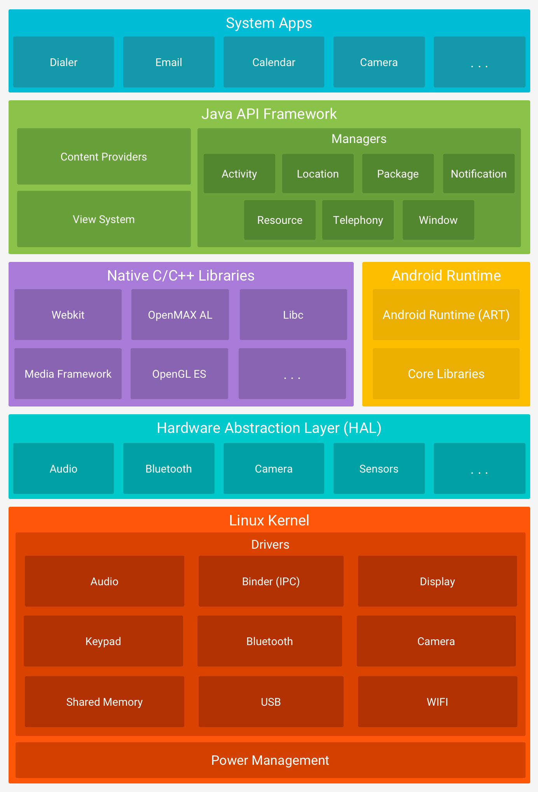
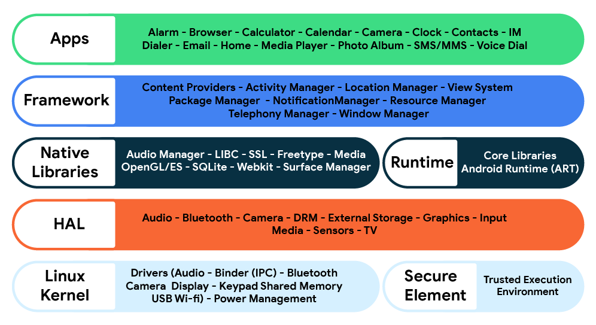
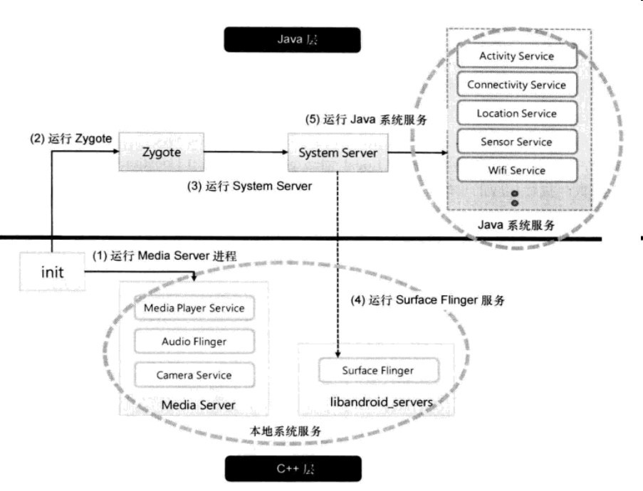
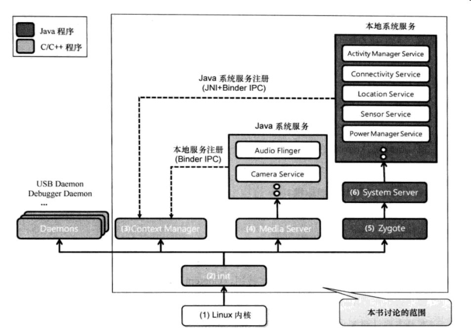

 

#### 一些说明 ####

这个系列学习的系统服务，绝大多数是`android.app.SystemServiceRegistry`里面注册的，包括核心平台服务以及硬件服务。如图，集中在第二层`Application framework`。

2017

2020 from developer.android.com

from source.android.com

其中核心平台服务包括：

- Context.ACTIVITY_SERVICE -> ActivityManager
- Context.WINDOW_SERVICE -> WindowManager
- PackageManagerService [该服务并非在SystemServiceRegistry中注册]
 

 

对比图一和图二，发现对本地系统服务和java系统服务定义是相反的，由于本地系统服务由C/C++编写，所以判定图一的定义是正确的。保留图二的原因是，图二展示了android系统init后的更多信息。
 
 

再来看图二，android init进程是对各种设备进行初始化，运行android framework所需要的各种daemon ，Context Manager，Media Serve, Zygote。

##### daemon #####
- USB Daemon(usbd):管理USB连接
- Android Debug Bridge Daemon(adbd):安卓调试桥链接管理
- Debugger Daemon(debuggerd):启动Debugger系统
- Radio Interface Layer Daemon(rild):管理无线通信连接

##### Context Manager ##### 
管理android系统服务的重要进程。系统服务是组成Android Framework的重要组件，提供从相机、音频、视频处理到应用程序制作所有重要API。

Context Manager提供运行与Android的各种系统服务的查询信息。应用程序或者Framework模块调用系统服务时，都要通过Binder IPC向Context Manager进行查询申请，获得相应的系统服务的信息。

同样，Android的系统服务也要通过Bindr IPC向Context Manager注册自己的Handle信息，以供查询。

##### Media Server #####

Media Server运行基于C/C++的本地系统服务，如Audio Flinger,Camera,Media play service.

##### Zygote #####

Zygote用于缩短android应用程序的加载时间，每当执行java应用程序时候，Zygote就会派生一个子进程，这个子进程就是用来执行java程序的虚拟机。

##### System Server #####

System Server是Android的一个系统进程，它是由Zygote创建的，在Android的启动过程中，位于Zygote之后。在System Server中可以看到它建立了android中的大部分服务，这些java层的系统服务需要通过JNI注册到ContextManager中去。

##### Binder #####

IPC(InterProcess Communication)进程间通信方式。 
RPC:远程过程调用就是一种在两个原本相互独立的进程间建立一种类似于单个程序内函数间调用的函数调用机制。 
Binder即支持IPC也支持RPC。

#### android系统服务列表[基于7.0] ####

| name | class | note |
| ------------- |:-------------:| -----:|
| ACCESSIBILITY_SERVICE | AccessibilityManager | 无障碍辅助服务 [传送](http://xusx1024.com/2017/04/20/android-system-service-AccessibilityManager/)|
| CAPTIONING_SERVICE | CaptioningManager | 弹幕、字幕管理[传送](http://xusx1024.com/2017/05/18/android-system-service-CaptioningManager/) |
| ACCOUNT_SERVICE | AccountManager | 账户管理器[传送](http://xusx1024.com/2017/08/17/android-system-service-Account-Manager/) |
| ACTIVITY_SERVICE | ActivityManager | 管理应用程序的系统状态[传送](http://xusx1024.com/2017/09/29/android-system-service-Activity-Manager/) |
| ALARM_SERVICE | AlarmManager | 闹钟的服务[传送](https://github.com/xusx1024/AndroidSystemServiceSample/tree/master/alarmmanagersample) |
| AUDIO_SERVICE | AudioManager | 声音管理 |
| MEDIA_ROUTER_SERVICE | MediaRouter | 扩展屏幕 |
| BLUETOOTH_SERVICE | BluetoothManager | 蓝牙 |
| HDMI_CONTROL_SERVICE |  HdmiControlManager | 管理所有的HDMI-CEC设备  HDMI-CEC标准允许多媒体消费产品之间沟通和交换信息， HDMI-CEC支持许多功能，比如遥控器直通，系统音频控制，一键播放等等。|
| CLIPBOARD_SERVICE | ClipboardManager | 剪贴板管理器 |
| CONNECTIVITY_SERVICE | ConnectivityManager | 网络连接管理器 |
| COUNTRY_DETECTOR | CountryDetector | 获取用户所在地国家码 |
| DEVICE_POLICY_SERVICE | DevicePolicyManager | 设备管理器 |
| DOWNLOAD_SERVICE | DownloadManager | 下载管理器 |
| BATTERY_SERVICE | BatteryManager | 电池管理器 |
| NFC_SERVICE | NfcManager | NFC管理器 |
| DROPBOX_SERVICE | DropBoxManager | 持续化存储系统数据管理器 |
| INPUT_SERVICE | InputManager | 输入事件管理器如触摸点击etc |
| DISPLAY_SERVICE | DisplayManager | 显示管理，支持多种显示类型的多个显示器的镜像显示，包括内建的显示类型（本地）、HDMI显示类型以及支持WIFI Display 协议( MIRACAST)，实现本地设备在远程显示器上的镜像显示。 |
| INPUT_METHOD_SERVICE | InputMethodManager | 输入法管理器 |
| TEXT_SERVICES_MANAGER_SERVICE | TextServicesManager | 检查拼写管理器 |
| KEYGUARD_SERVICE | KeyguardManager | 屏保管理器 |
| LAYOUT_INFLATER_SERVICE | [LayoutInflater](http://xusx1024.com/2017/02/23/android-system-service-LayoutInflater/) | 布局填充管理器 [传送](http://xusx1024.com/2017/02/23/android-system-service-LayoutInflater/) |
| NETWORK_POLICY_SERVICE | NetworkPolicyManager | 网络链接策略管理器 |
| NOTIFICATION_SERVICE | NotificationManager | 通知管理器 |
| NSD_SERVICE | NsdManager | 网络服务发现协议管理器 |
| POWER_SERVICE | PowerManager | 电源管理器 |
| RECOVERY_SERVICE | RecoverySystem | 刷机相关的-恢复模式服务 |
| SEARCH_SERVICE | SearchManager | 搜索服务，利用此服务可以实现对系统中的应用、联系人、SMS等进行搜索，也提供转入浏览器中的搜索 |
| SENSOR_SERVICE | SensorManager | 传感器管理器 |
| STATUS_BAR_SERVICE | StatusBarManager | 状态栏管理器 |
| STORAGE_SERVICE | StorageManager | 磁盘管理器 |
| TELEPHONY_SERVICE | TelephonyManager | 电话管理器 |
| TELEPHONY_SUBSCRIPTION_SERVICE | SubscriptionManager | SIM卡管理器 |
| CARRIER_CONFIG_SERVICE | CarrierConfigManager | 提供对特定于运营商的电话配置值的访问 |
| TELECOM_SERVICE | TelecomManager | 电话管理器 |
| UI_MODE_SERVICE | UiModeManager | 夜间模式这样的切换 |
| USB_SERVICE | UsbManager | USB管理器 |
| SERIAL_SERVICE | SerialManager | 端口管理器 |
| VIBRATOR_SERVICE | Vibrator | 振动器管理器 |
| WALLPAPER_SERVICE | WallpaperManager | 壁纸管理器 |
| WIFI_SERVICE | WifiManager | 无线网络管理器 |
| WIFI_P2P_SERVICE | WifiP2pManager | 点对点设备连接管理器，无需连接到网络 |
| WIFI_NAN_SERVICE | WifiNanManager |  neighborhood area network (NAN)的管理器- 邻区网（NAN）是Wi-Fi热点和无线局域网（WLAN）的分支，使用户能够以非常小的费用快速连接到互联网。 |
| WIFI_SCANNING_SERVICE | WifiScanner | wifi扫描管理器 |
| WIFI_RTT_SERVICE | RttManager | round-trip time (RTT)管理器 |
| ETHERNET_SERVICE | EthernetManager | 以太网IP配置管理器 |
| WINDOW_SERVICE | WindowManager | 窗口管理器 |
| USER_SERVICE | UserManager | 多用户管理器 |
| APP_OPS_SERVICE | AppOpsManager | Application Operations权限管理器 |
| CAMERA_SERVICE | CameraManager | 相机管理器 |
| LAUNCHER_APPS_SERVICE | LauncherApps | 不同用户的不同package管理器 |
| RESTRICTIONS_SERVICE | RestrictionsManager | 限制管理器 |
| PRINT_SERVICE | PrintManager | 打印管理器 |
| CONSUMER_IR_SERVICE | ConsumerIrManager | 红外发射管理器 |
| MEDIA_SESSION_SERVICE | MediaSessionManager | MediaSession概念用于播放器与控制器之间进行交互，媒体回话管理器 |
| TRUST_SERVICE | TrustManager | 信任证书管理器 |
| FINGERPRINT_SERVICE | FingerprintManager | 指纹管理器 |
| TV_INPUT_SERVICE | TvInputManager | 电视管理器 |
| NETWORK_SCORE_SERVICE | NetworkScoreManager | 网络子系统和网络记分器之间的通信管理器 |
| USAGE_STATS_SERVICE | UsageStatsManager | 使用情况统计管理器 |
| NETWORK_STATS_SERVICE | NetworkStatsManager | 流量统计管理器 |
| JOB_SCHEDULER_SERVICE | JobScheduler | 定时任务管理器 |
| PERSISTENT_DATA_BLOCK_SERVICE | PersistentDataBlockManager | 持久数据区管理器-出厂设置擦除数据相关 |
| MEDIA_PROJECTION_SERVICE | MediaProjectionManager | 系统屏幕截图管理器 |
| APPWIDGET_SERVICE | AppWidgetManager | 桌面组件管理器 |
| MIDI_SERVICE | MidiManager | （Musical Instrument Digital Interface，简称MIDI）是一个工业标准的电子通信协议.为电子乐器等演奏设备（如合成器）定义各种音符或弹奏码，容许电子乐器、电脑、手机或其它的舞台演出配备彼此连接，调整和同步，得以即时交换演奏数据。MIDI不发送声音，只发送像是音调和音乐强度的数据，音量，颤音和相位[1]等参数的控制信号，还有设置节奏的时钟信号。 比如钢琴学习应用。 |
| RADIO_SERVICE | RadioManager | 收音机管理器 |
| HARDWARE_PROPERTIES_SERVICE | HardwarePropertiesManager | 硬件属性管理器-CPU,GPU,电池温度,CPU各个核的使用,风扇速度 |
| SOUND_TRIGGER_SERVICE | SoundTriggerManager | 语音识别管理器 |
| SHORTCUT_SERVICE | ShortcutManager | App Shortcuts是指在桌面长按app图标而出现的快捷方式 |
| SYSTEM_HEALTH_SERVICE | SystemHealthManager | 系统资源使用情况管理器 |
| CONTEXTHUB_SERVICE | ContextHubManager | 上下文中心管理器 |

 
 