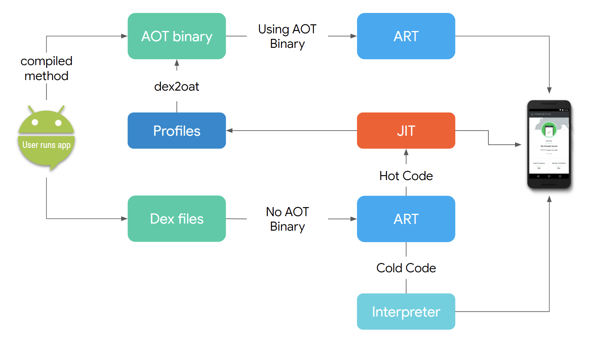

---
XuShengXing @ 2020年5月11日
---
 
### 打包流程

网上找到的流程图，可以参考：

### JVM

JVM有三个主要的区域：
1. ClassLoader: 加载编译后的字节码（.class 文件），链接，检测损坏的字节码，定位并初始化静态变量和静态代码
2. Runtime Data: 负责所有的程序数据：栈，方法变量，堆
3. Execution Engine: 负责执行已经加载的代码和GC

> 每当要运行程序时，解释器都要将字节码解释为机器码再运行。
>
> JIT编译器可以解决该问题。
>
> 每当执行引擎使用解析器解析代码，如果发现有重复执行的代码，就会切换未JIT编译器，
>
>JIT编译器会将这些重复的代码编译未本地机器代码，而当同样的方法再次被调用，已经编译好的本地机器代码(Hot Code)就会被直接运行，从而提升系统性能。
>
如下图所示：

###  JVM - Dalvik - Art

JVM 以栈为基础，所有的变量都存储在栈中；
Dalvik以寄存器为基础，所有的变量都存储在寄存器中。
Dalvik比JVM更加高效和节省空间。

ART和Dalvik的主要区别时，ART不在运行时进行解释和JIT编译，而是直接运行提醒编译好的.oat文件，这样运行速度更快。
.oat文件是ART使用AOT编译器提前编译好的。

art问题：
1. .dex文件编译为.oat是安装app过程的一部分，这导致安装或更新应用速度很慢；Android系统升级后，要花费时间重新`Optimizing app`
2. 所有的.dex文件都被编译为.oat文件，但是有些应用几乎或很少被使用，这样会浪费大量的磁盘空间。

对应的解决办法：
1. 安装app时候，不产生.oat文件。第一次运行应用的时候，ART使用解释器来解释执行.dex代码；
2. 如果有Hot Code，ART会调用JIT对代码进行编译
3. JIT编译过的代码和编译选项会存储在缓存中，以后每次执行同样的代码就会使用这里的缓存
4. 当设备空闲时（屏幕熄灭并且在充电），所有的Hot Code会被AOT编译器使用缓存的编译选项编译为.oat文件
5. 再次运行应用时候，位于.oat文件的代码会被直接执行，从而获得良好的性能，如果要执行的代码不在.oat文件，则回到第一步。
如下图所示：

art编译优化：
在相同的设备之间共享编译选项。

当设备空闲并且连接到wifi，它会将自身的编译profile通过play service共享给Google， 当有别的用户，使用相同配置的设备从play store下载同一个
应用，也会同时下载编译profile来指导AOT将经常运行的代码编译为.oat存储起来，这样一来，用户第一次就可以使用优化好的应用了。
猜测国内厂商也是如此吧。

### desugar 脱糖

java 8 增加了很多语法糖，这些不能直接用在Android，Android还在Java 6上。 
因此Google使用了Transformation来增加了一步编译过程：desugaring。把Java 8特性翻译为Dalvik/ART能够识别的java 6 字节码。

这样就导致了更长的编译时间。

### D8：解决desugar带来的开销

Android Studio 3.2版本， Google使用D8代替了旧的dx编译器。

让desugar成为d8的一部分。

看有人提供的数据，小项目100次的平均时间，能快2s。😂

### R8

有些Android设备厂商会修改JIT编译器的工作机制。

R8对.dex的最大优化就是它只保留了我们指定支持的设备所能理解的opcodes。

R8 对Kotlin更友好,更快，apk更小。

