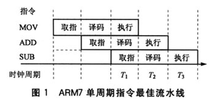

1. 一颗现代处理器，每秒大概可以执行多少条简单的MOV指令，有哪些主要的影响因素？

    每执行一条mov指令需要消耗1个时钟周期，所以每秒执行的mov指令和CPU主频相关。[处理器一条指令需要几个时钟周期？](https://blog.csdn.net/skyflying2012/article/details/51018640)
    
    对于软件工程师来说，印象流我们可能会觉得执行一条指令一个时钟周期嘛，一条指令算是一个最小的原子操作，不可能再细分了吧。
    如果看看诸如《see mips run》，《arm体系架构》等书籍就会了解到，这个问题可没这么简单了，因为处理器设计中使用了流水线技术。
    一条指令还是相当复杂的，处理器在一个时钟周期内肯定是完不成的，可能需要好多个时钟周期来完成执行。如果这样让处理器执行完一条指令，再去执行另一条，
    处理器的效率是很低的，假如一条指令是5个时钟周期完成，对于500MHZ的处理器串行运行指令，1秒内取指100000000次。
    因此处理器引入了流水线技术，将一条指令划分为多个功能，由不同的功能部件来执行，并且这些功能部件可以并行工作。下面是一个arm7的三级流水线运行图。
    
    
2. 如何实现一个高效的单向链表逆序输出？
```java
class Solution<T> {

    public void reverse(ListNode<T> head) {
       if (head == null || head.next == null) {
    	   return ;
       }
       ListNode<T> currentNode = head;
       Stack<ListNode<T>> stack = new Stack<>();
       while (currentNode != null) {
    	   stack.push(currentNode);
    	   ListNode<T> tempNode = currentNode.next;
    	   currentNode.next = null; // 断开连接
    	   currentNode = tempNode;
       }
       
       head = stack.pop();
       currentNode = head;
       
       while (!stack.isEmpty()) {
    	   currentNode.next = stack.pop();
    	   currentNode = currentNode.next;
       }
    }
}

class ListNode<T>{
	T val;
	public ListNode(T val) {
		this.val = val;
	}
	ListNode<T> next;
}
```   
3. 已知 sqrt (2)约等于 1.414，要求不用数学库，求 sqrt (2)精确到小数点后 10 位。
```java
public class Sqrt2 {

  static double v = 1e-10;

  public static void main(String[] args) {
        double sqt = sqt(2);
//    double sqt = myCalculate(1.4, 1.4, 1.5);
    System.out.println("符合误差的最终值");
    System.out.println(sqt);
  }

  public static double sqt(double c) {
    if (c < 0) {
      return Double.NaN;
    }

    double t = c;
    int count = 0;
    // 由于只是无限接近真正的平方根,所以比较c的估算平方根t,t的平方和初始c的差距,要小于指定误差,并计算次数
    while (Math.abs(t - c / t) > v * t) {

      // x2=(x1+c/x1)/2,不断计算x值,接近真是的值
      t = (c / t + t) / 2.0;
      count++;
      System.out.print("第" + count + "次计算");
      System.out.println(t);
    }
    return t;
  }

  // 根号2约等于 1.414
  private static double myCalculate(double ans, double low, double high) {
    double mid = 0;
    // 二分法,结束条件：差值小于等于1e-10即可
    while (true) {

      if (!(high - low > v)) break;
      mid = (high + low) / 2.0;
      System.out.println("-----------mid= " + mid + "  mid*mid= " + mid * mid);
      // 二分，逐步向中间值收拢
      if (mid * mid <= 2.0) {
        low = mid;
      } else {
        high = mid;
      }
    }

    return mid;
  }
}
```