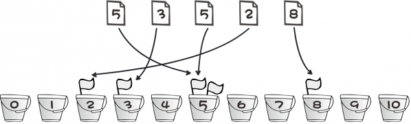

 

#### 简介 ####

探究Tinker的BSDiff算法的过程中，发现用到了`后缀排序`，就去研究后缀排序，然后发现用到`倍增算法`的思想。而倍增是排序的一种策略，这种策略要求必须对[基数排序](http://xusx1024.com/2017/04/10/radix-sort/)有一定的理解 T.T，而基数排序是`桶排序`的一种特例。 

#### 算法原理 ####

>简单暴力的来说，我们有一组数据，该组数据比如说是高数成绩，那么肯定有最大值，最小值，申请大小为100的桶数组，数组的下标即分数，数组的值代表相同分数的学生有几个。大概如图所示：
>
>
>
当然，上述只能有一个大概印象和基本理解，如果想要实际使用或者分析问题，还得看正规军。

 

桶排序的思想近乎彻底的分治思想。假设现在需要对一亿个数进行排序。我们可以将其等分到10000个虚拟的桶里，平均每个桶只有10000个数。如果每个桶都有序了，则只需顺次输出桶里的有序序列即可。思路如下： 
1. 将待排数据按一个映射函数f(x)分为连续的若干段。理论上最佳的分段方法应该使数据平均分布，实际上通常采用的方法都做不到这一点。显然，对于一个已知输入范围在[0,10000]的数组，最简单的分段莫过于x/m,例如f(x) = x/100.“连续的”这个条件非常重要，它是后面数据按顺序输出的理论保证。
2. 分配足够的桶，按照f(x)从数组起始处向后扫描，并把数据放到合适的桶中。对于上面的例子，如果数据有10000个，则我们需要分配101个桶（因为要考虑边界条件：f(x)=x/100会产生【0，100】共101种情况），理想情况下，每个桶有大约100个数据。
3. 对每个桶进行内部排序，例如，使用快速排序。注意，如果数据足够大，这里可以继续递归使用桶排序，直到数据大小降到合适的范围。
4. 按顺序从每个桶输出数据,排序完成。

[Data Structure Visualizations](http://www.cs.usfca.edu/~galles/visualization/BucketSort.html) 提供了一个桶排序的分步动画演示。

#### 实例分析 ####
设有数组 array = [29, 25, 3, 49, 9, 37, 21, 43]，那么数组中最大数为 49，先设置 5 个桶，那么每个桶可存放数的范围为：0~9、10~19、20~29、30~39、40~49，然后分别将这些数放人自己所属的桶，如下图：

然后，分别对每个桶里面的数进行排序，或者在将数放入桶的同时用插入排序进行排序。最后，将各个桶中的数据有序的合并起来，如下图：

#### 示例代码 ####
	
	package BuketsSort;
	
	import java.util.Arrays;
	
	/**
	 * 桶排序
	 * 
	 * @author sxx.xu
	 *
	 */
	public class BuketsSort {
	
		/*
		 * 桶排序
		 *
		 * 参数说明： a -- 待排序数组 max -- 数组a中最大值的范围
		 */
		public static void bucketSort(int[] a, int max) {
			int[] buckets;
	
			if (a == null || max < 1)
				return;
	
			// 创建一个容量为max的数组buckets，并且将buckets中的所有数据都初始化为0。
			buckets = new int[max];
	
			// 1. 计数
			for (int i = 0; i < a.length; i++)
				buckets[a[i]]++;
	
			// 2. 排序
			for (int i = 0, j = 0; i < max; i++) {
				while ((buckets[i]--) > 0) {
					a[j++] = i;
				}
			}
	
			buckets = null;
		}
	
		public static void bucketSort(int[] arr) {
			// 分桶，这里采用映射函数f(x)=x/10。
			// 输入数据为0~99之间的数字
			int bucketCount = 10;
			Integer[][] bucket = new Integer[bucketCount][arr.length]; // Integer初始为null,以与数字0区别。
			for (int i = 0; i < arr.length; i++) {
				int quotient = arr[i] / 10; // 这里即是使用f(x)
				for (int j = 0; j < arr.length; j++) {
					if (bucket[quotient][j] == null) {
						bucket[quotient][j] = arr[i];
						break;
					}
				}
			}
			// 小桶排序
			for (int i = 0; i < bucket.length; i++) {
				// insertion sort
				for (int j = 1; j < bucket[i].length; ++j) {
					if (bucket[i][j] == null) {
						break;
					}
					int value = bucket[i][j];
					int position = j;
					while (position > 0 && bucket[i][position - 1] > value) {
						bucket[i][position] = bucket[i][position - 1];
						position--;
					}
					bucket[i][position] = value;
				}
	
			}
			// 输出
			for (int i = 0, index = 0; i < bucket.length; i++) {
				for (int j = 0; j < bucket[i].length; j++) {
					if (bucket[i][j] != null) {
						arr[index] = bucket[i][j];
						index++;
					} else {
						break;
					}
				}
			}
		}
		
	 public static void bucketSort2(int [] arr){  
	        //寻找数组中min，max，用于建桶  
	        int min = 0, max = 0;  
	        for(int i = 0; i <= arr.length - 1; i++){  
	            if(arr[i] < min){  
	                min = arr[i];  
	            }  
	            if(arr[i] > max){  
	                max = arr[i];  
	            }  
	        }  
	        //开始建桶，注意桶的数量等于max - min + 1  
	        int bucketCount = max - min + 1;  
	        int[] bucket = new int[bucketCount];  
	        for(int i = 0; i <= arr.length - 1; i++){  
	            bucket[arr[i] - min]++;  
	        }  
	        for(int i = 1; i < bucketCount; i++){  
	            bucket[i] = bucket[i] + bucket[i - 1];  
	        }  
	        //开始排序  
	        int [] copy = new int[arr.length];  
	        System.arraycopy(arr, 0, copy, 0, arr.length);  
	          
	        //从后往前排序，保持元素相对位置，保证算法稳定性。  
	        for(int i = arr.length - 1; i >= 0; i--){  
	            arr[--bucket[copy[i] - min]] = copy[i];  
	        }  
	        //若从前往后排序，虽然排序结果相同，但会破坏元素相对位置和算法稳定性  
	//      for(int i = 0; i <= arr.length - 1; i++){  
	//          arr[--bucket[copy[i] - min]] = copy[i];  
	//      }  
	    }  
	
	
		public static void main(String[] args) {
			int i;
			int a[] = { 8, 2, 3, 4, 3, 6, 6, 3, 9 };
	
			System.out.printf("before sort:");
			for (i = 0; i < a.length; i++)
				System.out.printf("%d ", a[i]);
			System.out.printf("\n");
	
	//		bucketSort(a, 10); // 桶排序
	//		bucketSort(a); // 桶排序
			bucketSort2(a); // 桶排序
	
			System.out.printf("after  sort:");
			for (i = 0; i < a.length; i++)
				System.out.printf("%d ", a[i]);
			System.out.printf("\n");
		}
	}
