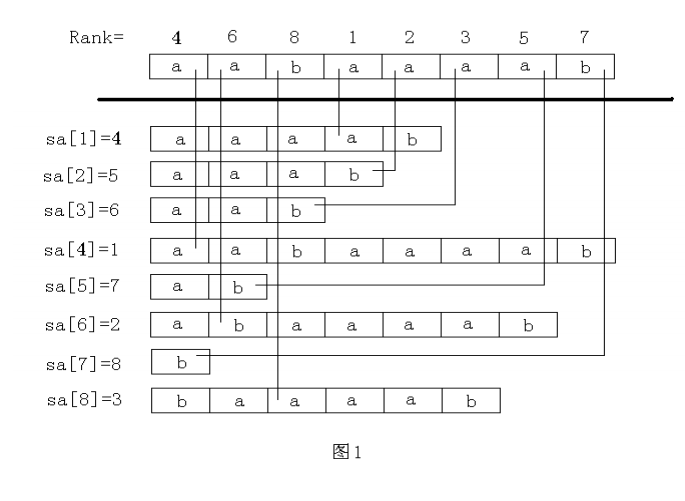
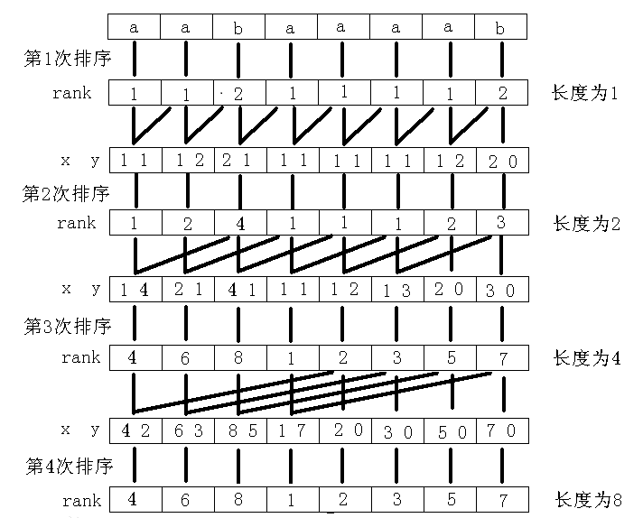

 

#### 简介 ####
有几个基本概念需要知道。 

>
1. **子串：**字符串S的子串r[i...j],i <= j,表示r串从i到j这一段，就是顺次排列r[i],r[i+1],...,r[j]形成的字符串;
2. **后缀：**从某个位置i开始，到整个字符串末尾结束的一个特殊子串。字符串S的从第i个字符开始的后缀表示suffix(i),也就是suffix(i) = r[i...len(r)]; 
3. **大小比较：**关于字符串的大小比较，是指通常所说的“字典顺序”比较，也就是对于两个字符串u、v，令从i=1，开始顺次比较u[i]和v[i]，如果u[i]=v[i]，则令i++，否则，若u[i]>v[i]则认为u>v，反之则认为u<v，比较结束。如果i>len(u)或者i>len(v)仍比较不出结果，那么若len(u)>len(v)，则认为u>v,反之则认为u<v. 从大小比较定义来看，S的后缀比较结果是不可能相等，因为u=v的必要条件len(u)=len(v)无法满足。
4. **后缀数组：**后缀数组SA是一个一维数组，它保存1...n的某个排列SA[1],SA[2],...,SA[n],并且保证suffix(SA[i])<suffix(SA[i+1]), 1 <= i < n。也就是将S的n个后缀从小到大进行排序之后，把有序的后缀的开头位置顺次放入SA中。
5. **名次数组：**名字数组rank[i]保存的是suffix(i)在所有后缀中从小到大排列的“名次”。简单的说，后缀数组SA是“排第几的是谁？”，名次数组rank是“你排第几？”。容易看出，后缀数组和名次数组互为逆运算。
6. **height数组：**定义height[i]=suffix(SA[i-1])和suffix(SA[i])的最长公共前缀，也就是排名相邻的两个后缀的最长公共前缀，h[i]=height[rank[i]],也就是suffix(i)和在它前一名的后缀的最长公共前缀
7. **LCP(i,j):**对正整数i,j定义LCP(i,j)=lcp(Suffix(SA[i]),Suffix(SA[j]),其中i,j均为1至n的整数。LCP(i,j)也就是后缀数组中第i个和第j个后缀的最长公共前缀的长度。其中，函数lcp(u,v)=max{i|u=v},也就是从头开始顺次比较u和v的对应字符，对应字符持续相等的最大位置，称为这两个字符串的最长公共前缀。

#### 算法原理 ####

 Prefix Doubling算法(前缀倍增法)是构造后缀数组一个比较实用的算法。其基本思想是先计算出每个后缀的k-前缀的rank值，然后在此基础上计算每个后缀的2k-前缀rank值，k从1开始。直到每个后缀都排出先后顺序为止(后缀必有先后顺序，原因见上面的解释)。在处理2k-前缀时，只需要使用[基数排序(radix sort)](http://xusx1024.com/2017/04/10/radix-sort/)算法，先后对两位数字排序，可以采用[计数排序算法(counting sort)](http://xusx1024.com/2017/04/11/counting-sort/)对每一位数字排序。在最坏情况下，需要做lgn次基数排序，每一次基数排序的操作次数为2*O(n),因此它的时间复杂是O(nlgn)。倍增法虽然没有达到想DC3算法的线性复杂度，但是它的优点是实现比较简单，因此常常被采用。

#### 实例分析 ####

  
 

#### 代码 ####
java语言实现： 

	package PrefixDoubling;
	
	import java.util.Arrays;
	
	/**
	 * 倍增算法实现后缀数组
	 * 
	 * @author sxx.xu
	 *
	 */
	public class PrefixDoubling {
	
		public static final char MAX_CHAR = '\u00FF';
	
		/**
		 * sa中第i个后缀：SA[rank[i]-1]; 
		 * i是rank数组的下标; 
		 * 串S的第i个后缀是S[i...n],n=S.length-1.
		 * 
		 * @author sxx.xu
		 *
		 */
		class Suffix {
			int[] sa;
			int[] rank;
			boolean done;
		}
	
		class Tuple {
			int iSuffix;
			int[] digits;
	
			public Tuple(int suffix, int[] digits) {
				this.iSuffix = suffix;
				this.digits = digits;
			}
	
			public String toString() {
				StringBuffer sb = new StringBuffer();
				sb.append(iSuffix);
				sb.append("(");
				for (int i = 0; i < digits.length; i++) {
					sb.append(digits[i]);
					if (i < digits.length - 1)
						sb.append("-");
				}
				sb.append(")");
				return sb.toString();
			}
		}
	
	
		private void countingSort(int d, Tuple[] tA, Tuple[] tB, int max) {
			int[] C = new int[max + 1];
			for (int i : C)
				i = 0;
	
			for (int j = 0; j < tA.length; j++) {
				C[tA[j].digits[d]]++;
			}
	
			for (int i = 1; i <= max; i++)
				C[i] += C[i - 1];
	
			for (int j = tA.length - 1; j >= 0; j--) {
	
				tB[--C[tA[j].digits[d]]] = tA[j];
	
			}
		}
	
		private void radixSort(Tuple[] tA, Tuple[] tB, int max, int digitsLen) {
			int len = tA.length;
			int digitsTotalLen = tA[0].digits.length;
	
			for (int d = digitsTotalLen - 1, j = 0; j < digitsLen; d--, j++) {
				this.countingSort(d, tA, tB, max);
				if (j < digitsLen - 1) {
					for (int i = 0; i < len; i++) {
						tA[i] = tB[i];
					}
				}
			}
	
		}
	
		private Suffix rank(Tuple[] tA, Tuple[] tB, int max, int digitsLen) {
			int len = tA.length;
			radixSort(tA, tB, max, digitsLen);
	
			int digitsTotalLen = tA[0].digits.length;
	
			int[] sa = new int[len];
			sa[0] = tB[0].iSuffix;
	
			int[] rank = new int[len];
			int r = 1;
			rank[tB[0].iSuffix] = r;
			for (int i = 1; i < len; i++) {
				sa[i] = tB[i].iSuffix;
	
				boolean equalLast = true;
	
				for (int j = digitsTotalLen - digitsLen; j < digitsTotalLen; j++) {
					if (tB[i].digits[j] != tB[i - 1].digits[j]) {
						equalLast = false;
						break;
					}
				}
	
				if (!equalLast) {
					r++;
				}
				rank[tB[i].iSuffix] = r;
			}
	
			Suffix suffix = new Suffix();
			suffix.rank = rank;
			suffix.sa = sa;
			if (r == len) {
				suffix.done = true;
			} else {
				suffix.done = false;
			}
	
			return suffix;
		}
	
		public Suffix solve(String text) {
			if (text == null)
				return null;
			int len = text.length();
			if (len == 0)
				return null;
	
			int k = 1;
			char base = text.charAt(len - 1);
			Tuple[] tA = new Tuple[len];
			Tuple[] tB = new Tuple[len];
	
			for (int i = 0; i < len; i++) {
				tA[i] = new Tuple(i, new int[] { 0, text.charAt(i) - base });
			}
	
			Suffix suffix = rank(tA, tB, MAX_CHAR - base, 1);
			while (!suffix.done) {
				k <<= 1;
				int offset = k >> 1;
				for (int i = 0, j = i + offset; i < len; i++, j++) {
					tA[i].iSuffix = i;
					tA[i].digits = new int[] { suffix.rank[i], (j < len) ? suffix.rank[i + offset] : 0 };
				}
				int max = suffix.rank[suffix.sa[len - 1]];
				suffix = rank(tA, tB, max, 2);
			}
			return suffix;
		}
	
		public void report(Suffix suffix) {
			int[] sa = suffix.sa;
			int[] rank = suffix.rank;
			int len = sa.length;
			System.out.println("suffix array:");
			for (int i = 0; i < len; i++)
				System.out.format(" %s", sa[i]);
	
			System.out.println();
			System.out.println("rank array:");
			for (int i = 0; i < len; i++)
				System.out.format(" %s", rank[i]);
			System.out.println();
		}
	
		public static void main(String[] args) {
			/*
			 * //plain counting sort test:
			 * 
			 * int[] A= {2,5,3,0,2,3,0,3}; PrefixDoubling pd = new PrefixDoubling();
			 * int[] B = new int[A.length]; pd.countingSort(A,B,5); for(int
			 * i=0;i<B.length;i++) System.out.format(" %d", B[i]);
			 * System.out.println();
			 */
	
			String text = "GACCCACCACC#";
			PrefixDoubling pd = new PrefixDoubling();
			Suffix suffix = pd.solve(text);
			System.out.format("Text: %s%n", text);
			pd.report(suffix);
	
			System.out.println("********************************");
			text = "mississippi#";
			pd = new PrefixDoubling();
			suffix = pd.solve(text);
			System.out.format("Text: %s%n", text);
			pd.report(suffix);
	
			System.out.println("********************************");
			text = "abcdefghijklmmnopqrstuvwxyz#";
			pd = new PrefixDoubling();
			suffix = pd.solve(text);
			System.out.format("Text: %s%n", text);
			pd.report(suffix);
	
			System.out.println("********************************");
			text = "yabbadabbado#";
			pd = new PrefixDoubling();
			suffix = pd.solve(text);
			System.out.format("Text: %s%n", text);
			pd.report(suffix);
	
			System.out.println("********************************");
			text = "DFDLKJLJldfasdlfjasdfkldjasfldafjdajfdsfjalkdsfaewefsdafdsfa#";
			pd = new PrefixDoubling();
			suffix = pd.solve(text);
			System.out.format("Text: %s%n", text);
			pd.report(suffix);
	
		}
	
	}
