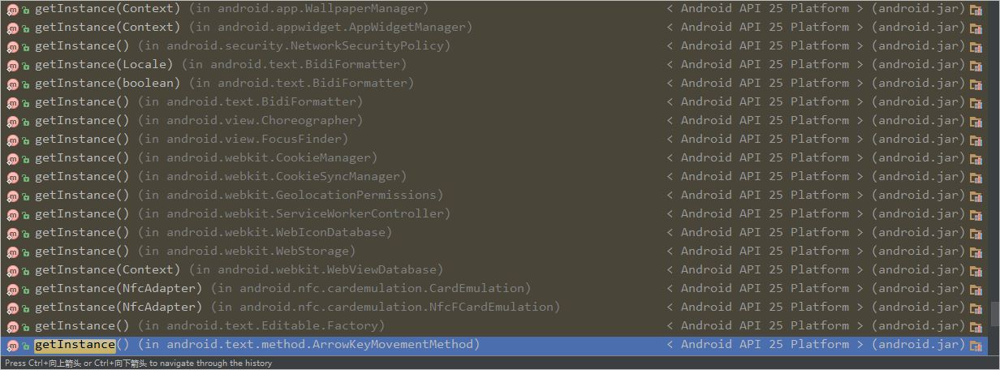
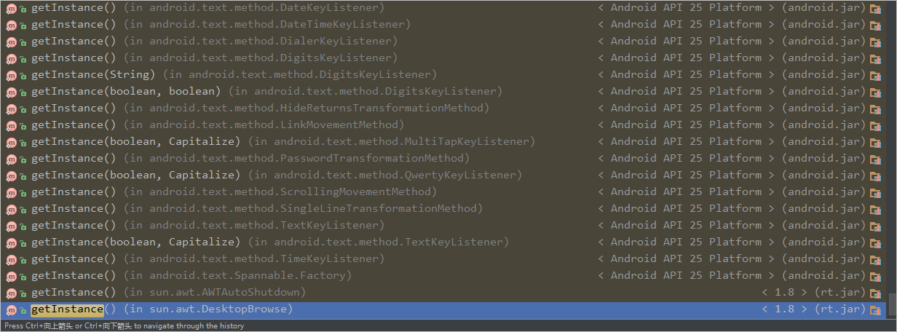

 


#### 写在前面的关键点 ####

我们知道，单例模式的特点：

- 只有一个实例
- 占用内存及资源较少，可防止对象不停的创建和销毁
- 全局访问
- 扩展性差
- 与单一职责原则有冲突

根据其特点，我们去看源码或者设计应用就可以做到有据可循了。

#### Android系统源码中 ####

##### 示例一【饿汉单例】：android.text.Editable.Factory.java #####
	
	   /**
	     * Factory used by TextView to create new Editables.  You can subclass
	     * it to provide something other than SpannableStringBuilder.
	     */
	    public static class Factory {
	        private static Editable.Factory sInstance = new Editable.Factory();
	      
	        public static Editable.Factory getInstance() {
	            return sInstance;
	        }

	        public Editable newEditable(CharSequence source) {
	            return new SpannableStringBuilder(source);
	        }
	    }

> Editable 即 `android.widget.EditText#getText()` 返回的对象。最常用的大概是`et.getText().toString()`吧。

然后从EditText-> TextView可以看到：

    private Editable.Factory mEditableFactory = Editable.Factory.getInstance();
    private Spannable.Factory mSpannableFactory = Spannable.Factory.getInstance();

然后考察其应用：

	 private InputFilter[] mFilters = NO_FILTERS;
	 private void setText(CharSequence text, BufferType type,
	                         boolean notifyBefore, int oldlen) {
		.
		.
		.

		Editable t = mEditableFactory.newEditable(text);
        text = t;
        setFilters(t, mFilters);

		.
		.
		.
	}

得到其用途：提供一个Editable的实现类【SpannableStringBuilder】的实例，然后应用filter。


##### 示例二【懒汉单例】：ArrowKeyMovementMethod.java #####

	private static ArrowKeyMovementMethod sInstance;	
    public static MovementMethod getInstance() {
        if (sInstance == null) {
            sInstance = new ArrowKeyMovementMethod();
        }

        return sInstance;
    }

>看类名好像是光标移动相关的东东，跟进去看一下好了。<br/>
>`initialize`初始化，把光标放在末尾位置；<br/>
>`onTouchEvent`处理触摸拖拽事件；<br/>
>`canSelectArbitrarily` 根据名字，是否可以任意选择，固定返回true；<br/>
>`onTakeFocus` 获取焦点后的默认操作：光标放末尾


##### 示例三【线程同步锁单例】：LocalBroadcastManager.java #####


	private static final Object mLock = new Object();
    private static LocalBroadcastManager mInstance;

    public static LocalBroadcastManager getInstance(Context context) {
        synchronized (mLock) {
            if (mInstance == null) {
                mInstance = new LocalBroadcastManager(context.getApplicationContext());
            }
            return mInstance;
        }
    }

>看类名是本地广播管理类，先看其类注释：<br/>

>
 Helper to register for and send broadcasts of Intents to local objects
 within your process.  This has a number of advantages over sending
 global broadcasts with {@link android.content.Context#sendBroadcast}<br/>
进程内帮助注册和发送广播给本地对象。相比于```Context#sendBroadcast```有巨大优势！<br/>

优势有三：<br/>
1. 应用内发送，不必担心私有数据泄露；<br/>
2. 别的应用无法发送我自己的应用本地广播，不必担心安全漏洞；<br/>
3. 比通过系统发送广播更加有效。

##### 示例四【线程同步锁单例】：InputMethodManager.java #####

	static InputMethodManager sInstance;
	public static InputMethodManager getInstance() {
	        synchronized (InputMethodManager.class) {
	            if (sInstance == null) {
	                IBinder b = ServiceManager.getService(Context.INPUT_METHOD_SERVICE);
	                IInputMethodManager service = IInputMethodManager.Stub.asInterface(b);
	                sInstance = new InputMethodManager(service, Looper.getMainLooper());
	            }
	            return sInstance;
	        }
	    }

>用来控制显示和隐藏输入法面板。
>
##### 示例五【容器单例】：FocusFinder.java #####
    
FocusFinder.java

	    private static final ThreadLocal<FocusFinder> tlFocusFinder =
            new ThreadLocal<FocusFinder>() {
                @Override
                protected FocusFinder initialValue() {
                    return new FocusFinder();
                }
            };

		public static FocusFinder getInstance() {
	        return tlFocusFinder.get();
	    }

ThreadLocal.java
	
	    /**
	     * Returns the value in the current thread's copy of this
	     * thread-local variable.  If the variable has no value for the
	     * current thread, it is first initialized to the value returned
	     * by an invocation of the {@link #initialValue} method.
	     *
	     * @return the current thread's value of this thread-local
	     */
	    public T get() {
	        Thread t = Thread.currentThread();
	        ThreadLocalMap map = getMap(t);
	        if (map != null) {
	            ThreadLocalMap.Entry e = map.getEntry(this);
	            if (e != null)
	                return (T)e.value;
	        }
	        return setInitialValue();
	    }
	
-
	
	    /**
	     * Variant of set() to establish initialValue. Used instead
	     * of set() in case user has overridden the set() method.
	     *
	     * @return the initial value
	     */
	    private T setInitialValue() {
	        T value = initialValue();
	        Thread t = Thread.currentThread();
	        ThreadLocalMap map = getMap(t);
	        if (map != null)
	            map.set(this, value);
	        else
	            createMap(t, value);
	        return value;
	    }
	
	    protected T initialValue() {
	        return null;
	    }

> 一个用来从当前焦点视图给定的方向中找到下个焦点视图的算法。主要功能代码在此方法里：


    private View findNextFocus(ViewGroup root, View focused, Rect focusedRect, int direction) {
        View next = null;
        if (focused != null) {
            next = findNextUserSpecifiedFocus(root, focused, direction);
        }
        if (next != null) {
            return next;
        }
        ArrayList<View> focusables = mTempList;
        try {
            focusables.clear();
            root.addFocusables(focusables, direction);
            if (!focusables.isEmpty()) {
                next = findNextFocus(root, focused, focusedRect, direction, focusables);
            }
        } finally {
            focusables.clear();
        }
        return next;
    }

##### 示例六【容器单例】：android.app.SystemServiceRegistry.java #####

>
该类我们就不粘贴代码了，因为Android里所有的系统的单例都维护在这里。

[源码地址](https://android.googlesource.com/platform/frameworks/base/+/master/core/java/android/app/SystemServiceRegistry.java)。

[服务说明在此](http://xusx1024.com/2017/02/22/android-system-service/)。

##### 示例七【别样的单例】：BidiFormatter.java #####

实例
	
		private static final BidiFormatter DEFAULT_LTR_INSTANCE = new BidiFormatter(
	            false /* LTR context */,
	            DEFAULT_FLAGS,
	            DEFAULT_TEXT_DIRECTION_HEURISTIC);
	
	    private static final BidiFormatter DEFAULT_RTL_INSTANCE = new BidiFormatter(
	            true /* RTL context */,
	            DEFAULT_FLAGS,
	            DEFAULT_TEXT_DIRECTION_HEURISTIC);

构造

	   private BidiFormatter(boolean isRtlContext, int flags, TextDirectionHeuristic heuristic) {
	        mIsRtlContext = isRtlContext;
	        mFlags = flags;
	        mDefaultTextDirectionHeuristic = heuristic;
	    }

获取实例：

    public static BidiFormatter getInstance() {
        return getDefaultInstanceFromContext(isRtlLocale(Locale.getDefault()));
    }
 
    public static BidiFormatter getInstance(boolean rtlContext) {
        return getDefaultInstanceFromContext(rtlContext);
    }
 
    public static BidiFormatter getInstance(Locale locale) {
        return getDefaultInstanceFromContext(isRtlLocale(locale));
    }

>BidiFormatter中的单例让我耳目一新。多种类型的static final 修饰的实例。<br/>
>这个类是4.2之后增加的新功能，通常文本是从左到右的顺序排列和阅读的。如果你是用阿拉伯语或者希伯来语，那么文本就从右往左排序才方便了。<br/>
>如果要开启，在Manifest.xml中，修改Application结点的属性`android:supportsRtl`为true<br/>
>另外，我们在xml布局时，经常看到提示：使用`android:layout_marginStart`替代`android:layout_marginLeft`这样的提示，这就是因为，在LTR和RTL模式下，view的布局是相反的，其相对距离也是相反，使用建议api，可省却该麻烦，真良心。

注1：
> 其中volatial修饰的实例没有找到，Enum实现的单例也没找到。


注2：Android 源码中常见单例(在AS中ctrl+alt+shift+n)：






#### Android App开发中 ####

分析上半部可得：

- 内部类单例-饿汉式
- 简单单例-懒汉式
- 多线程调用-带线程锁的懒汉式
- 多种单例-容器管理单例

我负责的app中，整理了一下，大概有如下会需要到单例：
1. Application
2. 定位、汉字转拼音、crash抓取、图片、网络、以及其他工具类
3. 升级管理

