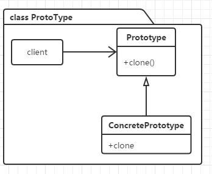
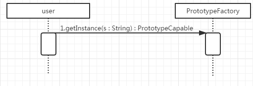

* content
{:toc}

#### 定义 ####

创建型模式的一种。通过复制一个已经存在的实例来返回新的实例，而不是新建实例。

>《设计模式》：  使用原型实例指定创建对象的种类，然后通过拷贝这些原型来创建新的对象。

#### 使用场景 ####

-  创建重复的新对象的成本较大—— 创建复杂，初始化消耗资源过多，初始化耗时，繁琐的数据准备，访问权限
-  一个对象多个修改者-浅拷贝
-  一个对象需要提供给其他对象访问，而且各个调用者可能都需要修改其值
-  在实际项目中，原型模式很少单独出现，一般是和工厂方法模式一起出现，通过clone的方法创建一个对象，然后由工厂方法提供给调用者
-  如果系统要保存对象的状态，而对象的状态变化很小，或者对象本身占内存不大的时候，也可以使用原型模式配合备忘录模式来应用。相反，如果对象的状态变化很大，或者对象占用的内存很大，那么采用状态模式会比原型模式更好

#### 类图 ####

#### 时序图 ####

#### 优点/缺点 ####

- clone并不一定比new一个对象速度快，只有new构造对象耗时或成功高时，clone才有明显的效率提升
- 逃避构造函数的约束(既是优点也是缺点)
- 配备克隆方法需要对类的功能进行通盘考虑，这对于全新的类不是很难，但对于已有的类不一定很容易，特别当一个类引用不支持串行化的间接对象，或者引用含有循环结构的时候
- 必须实现cloneable接口(java)

 
#### 深/浅复制 ####
 浅复制： 
复制了值类型对象，对于引用类型对象，只复制了引用，它指向原来引用的对象。
 
深复制： 
对值类型和引用类型的对象都生成一份新的拷贝，java中可以通过串行化来进行深复制，前提是对象以及其内部所引用的对象都是可串行化的，否则需要考虑把不可串行话的对象设为transient，排除在复制过程之外。 
被复制对象的任何变量都含有和原来的对象相同的值，除去那些引用其他对象的变量。那些引用其他对象的变量将指向被复制过的新对象，而不再是原有的那些被引用的对象。换言之，深复制把要复制的对象所引用的对象都复制了一遍。
 

#### 来自《effective java》的建议 ####

>第11条：谨慎地覆盖clone

克隆复杂对象，可以使用deep copy，也可以先调用super.clone，然后把结果对象中的所有域都设置成它们的空白状态，然后调用高层的方法来重新产生对象的状态。

建议使用拷贝构造器/拷贝工厂，确切地说是转换构造器/转换工厂。 

