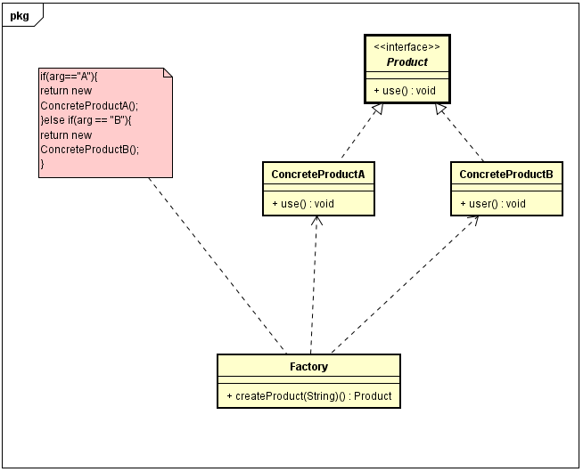
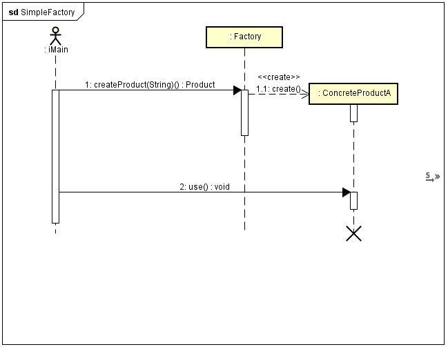

 

#### what ####

 简单工厂模式又称为静态工厂模式。根据不同的参数返回不同类的实例。简单工厂模式专门定义一个类来负责创建其他类的实例，被创建的实例通常具有共同的父类。

#### 模式结构 ####

- **Factory：工厂角色** 
	工厂角色负责实现创建所有实例

- **Product:抽象产品角色** 
	抽象产品角色是所创建的所有对象的父类，负责描述所有实例所共有的公共接口

- **ConcreteProduct:具体的产品角色** 
	具体产品角色是创建目标，所有创建的对象都充当这个角色的某个具体类的实例。
	
 

#### 时序图 ####

 

#### 代码 ####

[GitHub](https://github.com/xusx1024/DesignPatternDemoCode/tree/master/SimpleFactory)
 
抽象产品角色：

	package SimpleFactory;
	
	public interface Product {
		int TYPEA = 1;
		int TYPEB = 2;
	
		void use();
	}

具体的产品角色：
	
	package SimpleFactory;
	
	public class ConcreteProductA implements Product {
		@Override
		public void use() {
			System.out.println("useing concrete product A!");
		}
	}

	package SimpleFactory;
	
	public class ConcreteProductB implements Product {
		@Override
		public void use() {
			System.out.println("useing concrete product B!");
		}
	}

工厂角色：
	
	package SimpleFactory;
	
	public interface Product {
		int TYPEA = 1;
		int TYPEB = 2;
	
		void use();
	}

测试：
	
	package SimpleFactory;
	
	import static org.junit.Assert.*;
	
	public class Test {
		@org.junit.Test
		public void test() throws Exception {
			testing(Product.TYPEA);
			testing(Product.TYPEB);
			// testing(3);
		}
	
		public static void testing(int type) {
			Product p = ProductFactory.getTypeAConcreteProduct(type);
			assertNotEquals(p, null);
			p.use();
		}
	}

#### 分析 ####

- 创建对象和对象本身业务剥离，屏蔽创建对象的细节，降低耦合度，实现了责任的分割
- 简单工厂为静态方法，调用起来方便
- 工厂的职责过重，增加新的产品需要改变工厂的判断逻辑，违反了开闭原则，不利于扩展和维护

#### 使用场景 #### 

- 工厂类负责创建的对象比较少
