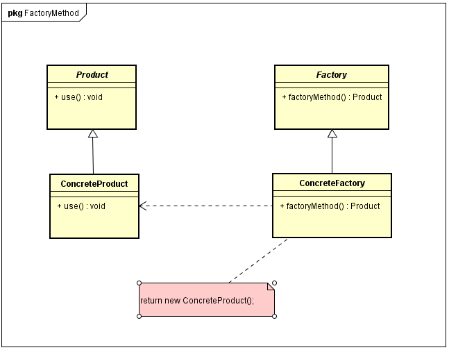
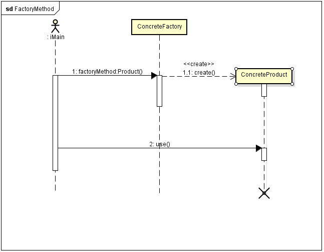

 
#### what ####

 工厂方法模式(Factory Method Pattern)又称为工厂模式，也叫作虚拟构造器(Virtual Constructor)模式或者多态工厂(Polymorphic Factory)模式，它属于类创建型模式。在工厂父类负责定义创建产品对象的公共接口，而工厂子类则负责生成具体的产品对象，这样做的目的是将产品类的实例化操作延迟到工厂子类中完成，即通过工厂子类来确定究竟应该实例化哪一个具体产品类。

#### 模式结构 ####

-  Factory：抽象工厂
-  ConcreteFactory：具体工厂
-  Product：抽象产品
-  ConcreteProduct：具体产品
	 

#### 时序图 ####
 

#### 代码 ####

 [GitHub](https://github.com/xusx1024/DesignPatternDemoCode/tree/master/FactoryMethod)

#### 分析 ####

- 创建对象和对象本身业务剥离，屏蔽创建对象的细节，降低耦合度，实现了责任的分割
- 基于工厂角色和产品角色的多态性设计是工厂方法模式的关键。它能够使工厂可以自主确定创建何种产品对象，而如何创建这个对象的细节则完全封装在具体工厂内部。所有的具体工厂类都具有同一抽象父类，因此又被称为多态工厂模式
- 增加新产品时，无须修改其他，只要添加一个具体工厂和具体产品就可以了，系统的扩展性很好，符合“开闭原则”
- 增加新产品时，系统中类的个数成对增加，一定程度上增加了系统的复杂度，带来额外开销
- 考虑到系统的可扩展性，需要引入抽象层，增加了系统的抽象性和理解难度。

#### 使用场景 #### 

- 调用者不知道它所需要的对象的类，但要知道创建具体产品的工厂类
- 一个类通过其子类来指定创建哪个对象，利用面向对象的多态性和里氏代换原则，在程序运行时，子类对象覆盖父类对象，从而使系统更容易扩展

#### 扩展 ####

- 使用多个工厂方法：在抽象工厂角色中可以定义多个工厂方法，从而使具体工厂角色实现这些不同的工厂方法，这些方法可以包含不同的业务逻辑，以满足对不同的产品对象的需求
- 产品对象的重复使用：工厂将已创建的产品保存到一个集合，然后根据客户对产品的请求，对集合进行查询，返回已有或创建新的
- 多态性的丧失和模式的退化：如果工厂仅仅返回一个具体产品对象，便违背了工厂方法的用意，发生退化，此时就不再是工厂方法模式了。一般来说，工厂对象应当有一个抽象的父类型，如果工厂等级结构中只有一个具体工厂类的话，抽象工厂就可以省略，也将发生退化。当只有一个具体工厂，在具体工厂中可以创建所有的产品对象，并且工厂方法设计为静态方法是，工厂方法模式就退化成简单工厂模式。
