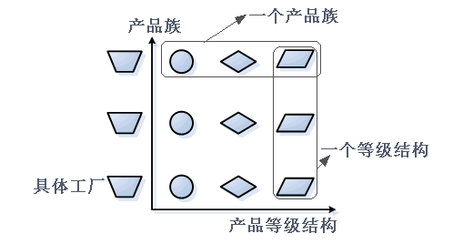
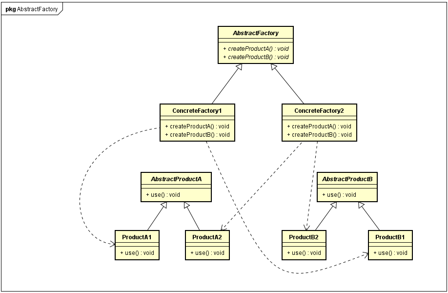
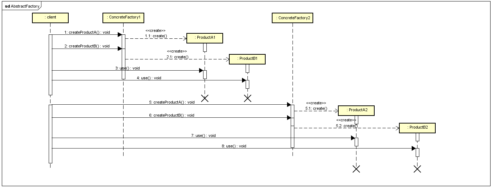

#### 引入概念 ####

- **产品等级结构：**产品等级结构即产品的继承结构，如一个抽象类是电视机，其子类有海尔电视机、海信电视机、TCL电视机，则抽象电视机与具体品牌的电视机之间构成了一个产品等级结构，抽象电视机是父类，而具体品牌的电视机是其子类。
- **产品族：** 在抽象工厂模式中，产品族是指由同一个工厂生产的，位于不同产品等级结构中的一组产品，如海尔电器工厂生产的海尔电视机、海尔电冰箱、海尔电视机。

 

#### what ####

 抽象工厂模式(Abstract Factory Pattern)：提供一个创建一系列相关或相互依赖对象的接口，而无须指定它们具体的类。抽象工厂模式又称为kit模式，属于对象创建型模式。

#### 模式结构 ####

-  Factory：抽象工厂
-  ConcreteFactory：具体工厂
-  Product：抽象产品
-  ConcreteProduct：具体产品
	

#### 时序图 ####

#### 代码 ####

 [GitHub](https://github.com/xusx1024/DesignPatternDemoCode/tree/master/AbstractFactory)

#### 分析 ####

- 抽象工厂定义了产品的所有行为，因此增加产品族很方便，增加产品等级类别需要改动抽象工厂(开闭原则的倾斜性)
- 当一个产品族中的多个对象被设计成一起工作时，它能保证客户端始终只使用同一个产品族中的对象。这对一些需要根据当前环境来决定其行为的软件系统来说，是一种非常实用的设计模式
- 

#### 使用场景 #### 

- 适用于产品确定，但是产品线不确定的场景，比如要生产汽车，但是汽车的配置不确定
- 比如app换肤，整体的颜色，字体，背景，按钮，文本框。。。

#### 扩展 ####

当抽象工厂模式中每一个具体工厂类只创建一个产品对象，也就是只存在一个产品等级结构时，抽象工厂模式退化成工厂方法模式；当工厂方法模式中抽象工厂与具体工厂合并，提供一个统一的工厂来创建产品对象，并将创建对象的工厂方法设计为静态方法时，工厂方法模式退化成简单工厂模式。
