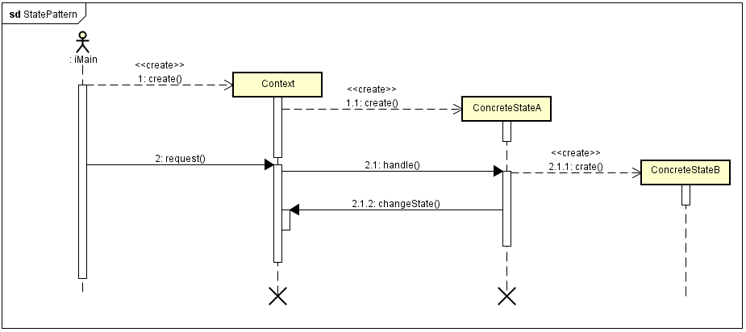

 

#### what ####
 
状态模式是对象行为型模式 

看完状态模式的模式的类图和时序图，真的，和策略模式一毛一样。但是他们的思想是不同的。策略模式的具体实现类是可以根据选择的策略不同来相互替换的，状态模式是根据当前对象的不同而执行对应的状态实现。策略模式的选择权在于调用者，而状态模式的选择权更多在于用户使用软件操作后的结果。这是我自己的理解。 

状态模式(State Pattern)：允许一个对象在其内部状态改变时改变它的行为，对象看起来似乎修改了它的类。其别名为状态对象(Object for State).

#### 模式结构 ####

-  Context:环境类
-  State：抽象状态类
-  ConcreteState：具体状态类
 

#### 时序图 ####

 

#### 代码 ####

 [GitHub](https://github.com/xusx1024/DesignPatternDemoCode/tree/master/StatePattern)

#### 适用场景 ####

- 对象的行为依赖于它的状态(属性)并且可以根据它的状态改变而改变它的相关行为
- 代码中包含大量与对象状态有关的条件语句，这些条件语句的出现，会导致代码的可维护性和灵活性变差，不能方便地增加和删除状态，是客户类与类库之间的耦合性增强。在这些条件语句中包含了对象的行为，而且这些条件对应于对象的各种状态。

#### 分析 ####

- 在有些情况下多个环境对象需要共享同一个状态，如果希望在系统中实现多个环境对象实例共享一个或多个状态对象，那么需要将这些状态对象定义为环境的静态成员对象
- 简单状态模式和可切换状态的状态模式
