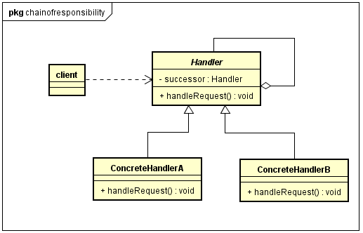
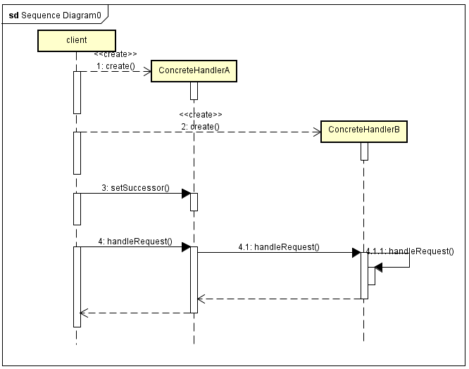

#### what ####
 
责任链模式是对象行为型模式 

责任链模式(Chain of Responsibility Pattern)：避免请求发送者与接收者耦合在一起，让多个对象都有可能接收请求，将这些对象连接成一条链，并且沿着这条链传递请求，直到有对象处理它为止。 

客户端无须关心请求的处理细节以及请求的传递，只需将请求发送到链上即可，实现发送者和接收者耦合解耦。

 
#### 模式结构 ####

- Handler(抽象处理者)：它定义了一个处理请求的接口，一般设计为抽象类，由于不同的具体处理者处理请求的方式不同，因此在此定义了抽象方法。因为每一个处理者的下家还是一个处理者，因此在抽象处理者中定义了一个抽象处理者类型的对象，作为其对下家的引用，通过该引用，处理者可以连成一条链
- ConcreteHandler(具体处理者)：它是抽象处理者的子类，可以处理用户请求，在具体处理者类中实现了抽象处理者中定义的抽象请求处理方法，在处理请求之前需要进行判断，看是否有相应的处理权限，如果可以处理请求就处理，否则转发给后继者。

#### 时序图 ####

#### 代码 ####

 [GitHub](https://github.com/xusx1024/DesignPatternDemoCode/tree/master/ChainOfResponsibility)

#### 适用场景 ####

 - 有多个对象可以处理同一个请求，具体哪个对象处理该请求待运行时刻再确定，客户端只需将请求提交到链上，而无须关心请求的处理对象是谁以及它是如何处理的
 - 在不明确指定接收者的情况下，向多个对象中的一个提交一个请求
 - 可动态指定一组对象处理请求，客户端可以动态创建职责链来处理请求，还可以改变链中处理者之间的先后次序。 

#### 分析 ####

- 责任链可以是一条直线、一个环、或者一个树形结构，最常见的的直线型
- 在责任链模式里，很多对象由每一个对象对其下家的引用而连接起来形成一条链。请求在这个链上传递，直到链上的某一个对象决定处理此请求。发出这个请求的客户端并不知道链上的哪一个对象最终处理这个请求，这使得系统可以在不影响客户端的情况下动态地重新组织链和分配责任。
- 责任链模式并不创建责任链，责任链的创建工作一般在使用该责任链的客户端完成。
- 纯的责任链模式要求一个具体处理者对象只能在两个行为中选择一个：要么承担全部责任，要么将责任推给下家，并且要求一个请求必须被某一个处理者对象所接收，不能出现某个请求未被处理的情况
- 不纯的责任链模式，关于请求，允许部分处理后向下传递，也允许处理完后继续向下传递，也允许最终不被任何处理者接收。
