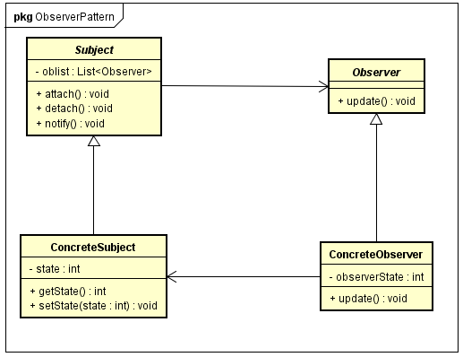
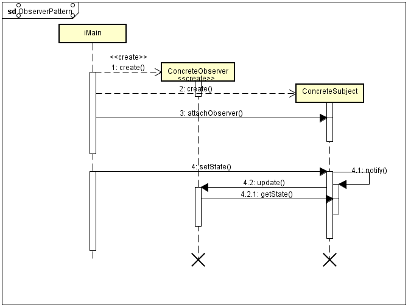

#### 定义 ####

建立一种对象与对象之间的依赖关系，一个对象发生改变时将自动通知其他对象，其他对象将相应做出反应。在此，发生改变的对象称为观察目标，而被通知的对象称为观察者。一个观察目标可以对应多个观察者，而且这些观察者之间没有相互联系，可以根据需要增加和删除观察者，使得系统更易于扩展。

观察者模式(Observer Pattern)：定义对象间的一种一对多的依赖关系，使得每当一个对象状态发生改变时，其相关依赖对象皆得到通知并被自动更新。观察者模式又叫做发布-订阅(publish/subscribe)模式、模型-视图(model/view)模式、源-监听器(source/listener)模式或从属者(dependents)模式。

#### 模式结构 ####
- Subject：目标
- ConcreteSubject：具体目标
- Observer：观察者
- ConcreteObserver：具体观察者

#### 时序图 ####

#### 代码 ####
[GitHub](https://github.com/xusx1024/DesignPatternDemoCode/tree/master/ObserverPattern)
#### 分析 ####
##### 优点 #####
- 可以实现表示层和数据逻辑层分离，并定义了稳定的消息更新传递机制
- 观察者和目标之间是一个抽象的耦合
- 支持广播通信
- 符合开闭原则

##### 缺点 #####
- 如果目标有许多观察者，通知所有观察者会花费许多时间
- 如果观察者和目标之间有循环依赖的话，目标会触发他们之间的循环调用
- 观察者无法知道目标是如何发生变化的，只是知道目标发生了变化

#### 扩展 ####
MVC模式可以用观察者模式来实现，其中观察目标就是Model，观察者就是View，中介者就是Controller。当Model数据发生改变，View将自动改变其显示内容。
