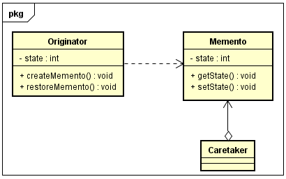
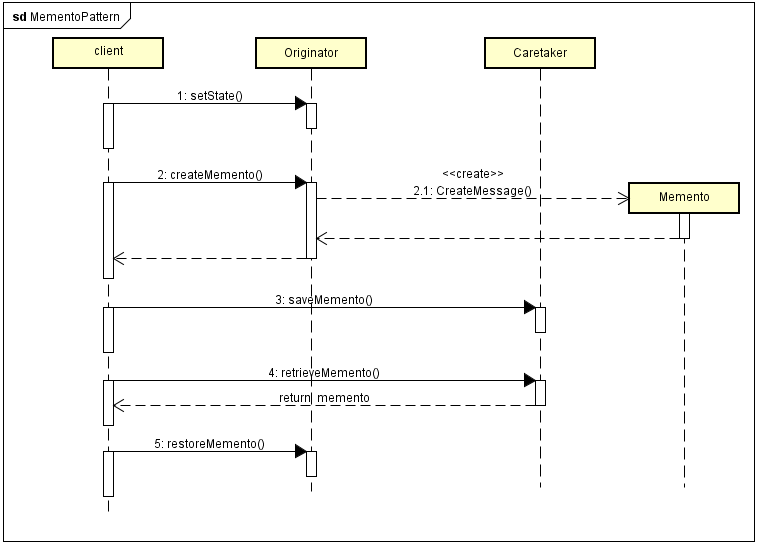

#### 定义 ####

备忘录模式(Memento Pattern):在不破坏封装的前提下，捕获一个对象的内部状态，并在该对象之外保存这个状态，这样可以在以后将对象恢复到原先保存的状态。这是一种对象行为型模式，别名为Token，又称作Snapshot。
  
#### 模式结构 ####

-  Originator(原发器):它是一个普通类，可以创建一个备忘录，并存储它的当前内部状态(比如象棋的某一步)，也可以使用备忘录来恢复其内部状态，一般将需要保存内部状态的类设计为原发器
-  Memento(备忘录):存储原发器的内部状态，根据原发器来决定保存哪些内部状态。备忘录的设计一般可以参考原发器的设计，根据实际需要确定备忘录类中的属性。需要注意的是，除了原发器本身与负责人类之外，备忘录对象不能直接供其他类使用
-  Caretaker(负责人):负责人又称为管理者，它负责保存备忘录，但是不能对备忘录的内容进行操作或检查。在负责人类中可以存储一个或多个备忘录对象，它只负责存储对象，而不能修改对象，也无须知道对象的实现细节。
 

#### 时序图 ####

#### 代码 ####

[GitHub](https://github.com/xusx1024/DesignPatternDemoCode/tree/master/MementoPattern)

#### 分析 ####

应用领域包括：文字处理 、图像编辑、数据库管理系统等软件中。

##### 优点 #####

- 提供了一种状态恢复的实现机制
- 备忘录实现了对信息的封装，一个备忘录对象是一种原发器对象状态的表示，不会被其他代码改动

##### 缺点 #####

-  如果原发器的类成员变量过多，会占用大量空间

#### 扩展 ####

- 备忘录做成原发器的内部类
- 备忘录的生成使用[原型设计模式](http://xusx1024.com/2017/03/18/design-patterns-prototype-1/)
- 备忘录模式通常与命令模式和迭代子模式一同使用
- 保证负责人不能对备忘录修改的方法，使用标识接口
		package MementoPattern;
		
		/**
		 *  备忘录模式中，管理者只负责管理，是不可以修改备忘录的 
		 *  
		 *  所以，使用标识接口{@link MementoIF}}，管理者便不能修改备忘录的内容
		 * 
		 * @author sxx.xu
		 *
		 */
		public class MementoCaretaker3 {
			private MementoIF memento;
		
			public MementoIF getMemento() {
				return memento;
			}
		
			public void setMemento(MementoIF memento) {
				this.memento = memento;
			}
		
		}  

- “自述历史”模式（History-On-Self Pattern），备忘录模式的特殊实现形式。Demo:[GitHub](https://github.com/xusx1024/DesignPatternDemoCode/tree/master/HistoryOnSelfPattern)

