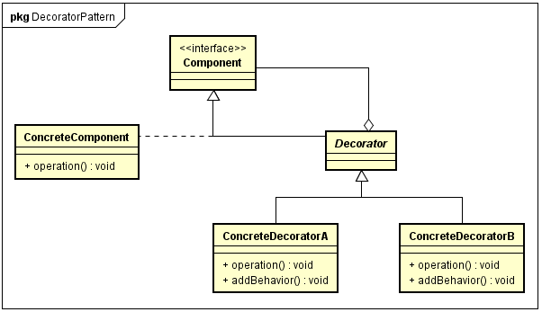
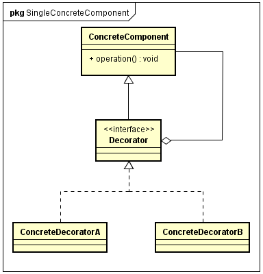
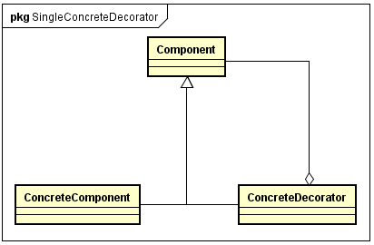
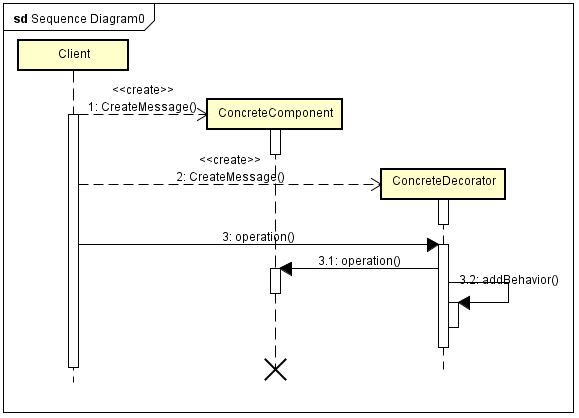

#### 定义 ####

装饰模式（Decorator Pattern）：动态地给一个对象增加一些额外的职责，就增加对象功能来说，装饰模式比生成子类实现更为灵活。装饰模式是一种对象结构型模式。其别名也称为包装器（Wrapper），与适配器模式的别名相同，但是他们适用于不同的场合。装饰模式也有人称之为“油漆工模式”。
  
#### 模式结构 ####

- Component:抽象构件角色。给出一个接口，以规范准备接收附加责任的对象。
- ConcreteComponent：具体构件角色。定义一个将要接收附加责任的类。
- Decorator：装饰角色。持有一个构件对象的实例，并定义一个与抽象构件接口一致的接口。
- ConcreteDecorator：具体装饰角色。负责给构件对象添加责任。

> 如果只有一个具体组件(ConcreteComponent)，可以考虑去掉抽象组件类(Component)，把Decorator做为一个ConcreteComponent子类。

> 如果只有ConcreteDecorator，那么没必要建立一个单独的Decorator类，而可以把Decorator和ConcreteDecorator的责任合并成一个类。甚至在只有两个ConcreteDecorator类的情况下，都可以这样做。

 
#### 时序图 ####

#### 代码 ####

[GitHub](https://github.com/xusx1024/DesignPatternDemoCode/tree/master/DecoratorPattern)

#### 分析 ####
 
- 与继承关系相比，关联关系的主要优势在于不会破坏类的封装性，而且继承是一种耦合度较大的静态关系，无法在程序运行时动态扩展。在软件开发阶段，关联关系虽然不会比继承关系减少编码量，但是到了软件维护阶段，由于关联关系使系统具有较好的松耦合性，因此使得系统更加容易维护。当然，关联关系的缺点是比继承关系要创建更多的对象。
- 使用装饰模式来实现扩展比继承更加灵活，它以对客户透明的方式动态地给一个对象附加更多的责任。装饰模式可以在不需要创造更多子类的情况下，将对象的功能加以扩展。
 

##### 优点 #####

- 通过一种动态方式来扩展一个对象的功能，通过配置文件在运行时选择不同的装饰器，从而实现不同的行为
- 具体构件类和具体装饰类可以独立变化，用户可以根据需要增加新的具体构件类和具体装饰类，在使用时再对其进行组合，原有代码无须改变，符合“开闭原则”
   
##### 缺点 #####

- 装饰模式会产生许多小对象，这些对象的区别在于它们之间相互连接的方式不同，会增加系统的复杂度 
- 比继承更加灵活，也比继承更加容易出错，排错比较困难，对于多次装饰的对象，调试更加繁琐

#### 应用 ####

- 修改一个final类
- 动态、透明的添加/撤销对象的职责
- 系统中存在大量独立的扩展，为支持每一种组合将产生大量的子类，使得子类数目呈爆炸性增长

#### 扩展-透明性要求 ####

装饰模式对客户端的透明性要求程序不要声明一个具体类型（ConcreteComponent）的变量，而应当声明一个Component类型的变量。

然而纯粹的装饰很难找到，在增强性能的时候，需要增加新的公开的方法，这就意味着客户端可以声明具体类型，从而调用具体装饰器中的新增方法。

半透明装饰模式是介于装饰模式和适配器模式之间的。大多装饰模式实际上是半透明的，这样的装饰模式也称作半装饰、半适配器模式。

#### 开发中应用 ####

update@2017年7月17日11:16:45

需求：需要一个垂直，自动滑动的ViewPager。

我已有一个横向，自动滑动的ViewPager。打算使用装饰者设计模式，添加垂直滑动的行为。

分析：

- ViewPager只有一个实现类，所以装饰类可以直接继承该具体实现类
- 由于又只有一个具体装饰类，可以省略掉抽象装饰类

结果：退化为继承

本来的目的是使用装饰者模式，来增加行为。现在由于需求比较简单，使用继承即可。
 

