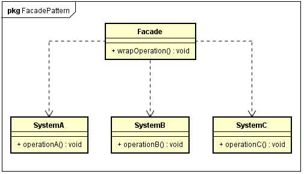
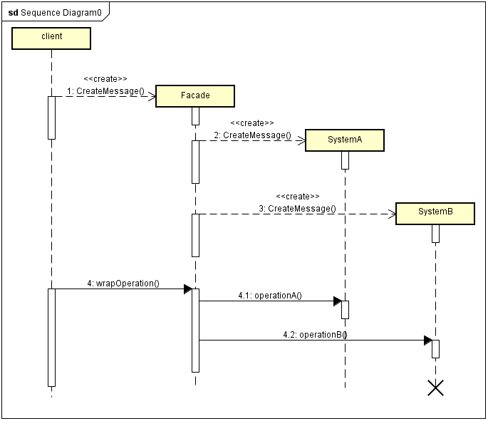

#### 定义 ####

外观模式(facade pattern):外部与一个子系统的通信必须通过一个统一的外观对象进行，为子系统中的一组接口提供一个一致的界面，外观模式定义了一个高层接口，这个接口使得这一子系统更加容易使用。外观模式又称为门面模式，它是一种对象结构型模式。

注意：facade大概读音“佛撒的”，不要读做“非K特” ==！
  
#### 模式结构 ####

- Facade：外观角色
- SubSystem：子系统角色

  
#### 时序图 ####

#### 代码 ####

[GitHub](https://github.com/xusx1024/DesignPatternDemoCode/tree/master/FacadePattern)

	package FacadePattern;
	
	/**
	 * 不要通过继承一个门面类，为某个子系统增加行为。 
	 * 
	 * 使用装饰、适配器等为具体的子系统添加行为。 
	 * 
	 * Facade只是为子系统提供一个集中化和简化的沟通管道，不能向子系统中添加行为。 
	 * 
	 * final只能阻止继承，不能阻止通过其他方式添加行为，这个需要依靠开发者的自律的，是个缺点。 
	 * 
	 * 外观类可以有多个，因此可以引入抽象外观类来对系统进行改进。 
	 * 
	 * 这样又和策略模式相似了，策略是行为型，外观是对象型。
	 * @author sxx.xu
	 *
	 */
	public final class Facade {
	
		public void operation() {
			SystemA a = new SystemA();
			SystemB b = new SystemB();
	
			a.operationA();
			b.operationB();
		}
	}

********
	
	package FacadePattern;
	
	/**
	 * 可以同时有多个子系统类，每个子系统都不是一个单独的类，而是一个类的集合。 
	 * 
	 * 子系统可以被客户端调用，也可以被外观调用。 
	 * 
	 * @author sxx.xu
	 *
	 */
	public class SystemA {
	
		public void operationA() {
			System.out.println("SystemA operation");
		}
	}

#### 分析 ####

##### 优点 #####

- 根据“单一职责原则”，在软件中将一个系统划分为若干个子系统有利于降低整个系统的复杂性，一个常见的设计目标是使子系统间的通信和相互依赖关系达到最小，而达到该目标的途径之一就是引入一个外观对象，它为子系统的访问提供了一个简单而单一的入口。
- 外观模式也是“迪米特法则”的体现，通过引入一个新的外观类可以降低原有系统的复杂度，同时降低客户类与子系统类的耦合度
- 外观类将客户端与子系统的内部复杂性分隔开，使得客户端只需要与外观对象打交道，而不需要与子系统内部的很多对象打交道

##### 缺点 #####

-  不能很好地限制客户使用子系统类，如果对客户访问子系统类做太多限制则减少了可变性和灵活性
-  在不引入抽象外观类的情况下，增加新的子系统可能需要修改外观类或客户端的源代码，违背了“开闭原则”

 

 

