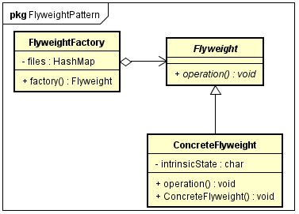
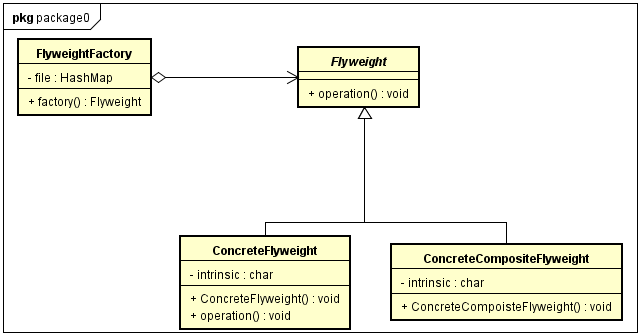
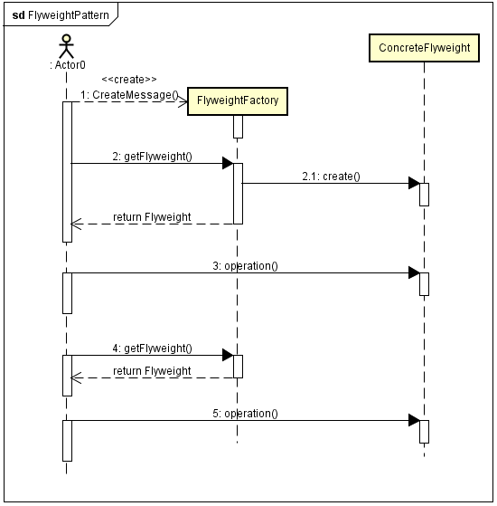

#### 定义 ####

享元模式(flyweight pattern):运用共享技术有效地支持大量细粒度对象的复用。系统只使用少量的对象，而这些对象都很相似，状态变化很小，可以实现对象的多次复用。由于享元模式要求能够共享的对象必须是细粒度对象，因此它又称为轻量级模式，它是一种对象结构型模式。
  
#### 模式结构 ####

- Flyweight：抽象享元角色。给出抽象接口，定义具体享元角色需要实现的方法
- ConcreteFlyweight：具体享元角色。实现抽象享元角色，如果有内蕴状态，必须负责为内蕴状态提供存储空间。
- ConcreteCompositeFlyweight：复合享元角色。复合享元角色所代表的对象是不可以共享的，但是一个复合享元对象可以分解成多个本身是单纯享元对象的组合。复合享元对象又称作不可共享的享元对象。
- FlyweightFactory：享元工厂角色。负责创建和管理享元角色。

##### 单纯享元模式 #####

##### 组合享元模式 #####

  
#### 时序图 ####

#### 代码 ####

[GitHub](https://github.com/xusx1024/DesignPatternDemoCode/tree/master/FlyweightPattern)

#### 分析 ####

##### 优点 #####

- 它可以极大减少内存中对象的数量，使得相同对象或相似对象在内存中只保存一份
- 外部状态相对独立，而且不会影响其内部状态，从而使得享元对象可以在不同的环境中被共享

##### 缺点 #####

-  使系统更加复杂，需要分离出内部状态和外部状态，使逻辑复杂化
-  为了使对象可以共享，享元模式需要将享元对象的状态外部化，而读取外部状态使得运行时间变长

 

 

