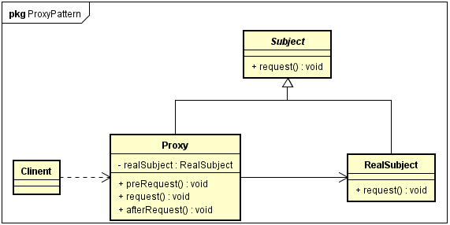
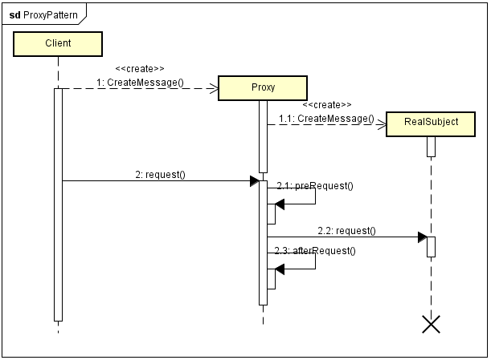

#### 定义 ####

代理模式(proxy pattern):给某一个对象提供一个代理，并由代理对象控制对原对象的引用。代理的英文叫做Proxy或者Surrogate，它是一种对象结构型模式。
  
#### 模式结构 ####

- subject：抽象对象角色。声明了目标对象和代理对象的共同接口，这样在任何可以使用目标对象的地方都可以使用代理对象
- realSubject：代理对象所代表的目标对象
- proxy：代理对象角色。代理对象内部含有目标对象的引用，从而可以在任何时候操作目标对象；代理对象提供一个与目标对象相同的接口，以便可以在任何时候替代目标对象。代理对象通常在客户端调用传递给目标对象之前或之后，执行某个操作，而不是单纯地将调用传递给目标对象

  
#### 时序图 ####

#### 代码 ####

[GitHub](https://github.com/xusx1024/DesignPatternDemoCode/tree/master/ProxyPattern)

#### 分析 ####

##### 优点 #####

- 代理模式能够协调调用者和被调用者，在一定程度上降低了系统的耦合度
- 远程代理使得客户端可以访问在远程机器上的对象，远程机器可能具有更好的计算性能与处理速度，可以快速响应并处理客户端请求
- 虚拟代理通过使用一个小对象来代表一个大对象，可以减少系统的资源消耗，对系统进行优化并提高运行速度
- 保护代理，可以控制对真实对象的使用权限

##### 缺点 #####

-  由于在客户端和真实主题之间增加了代理对象，因此有些类型的代理模式可能会造成请求的处理速度变慢
-  实现代理模式需要额外的工作，有些代理模式实现非常复杂

#### 扩展-代理的应用 ####

- 远程（Remote）代理：为一个位于不同的地址空间的对象提供一个本地的代理对象，这个不同的地址空间可以是在同一台主机中，也可以是在另一台主机中，远程代理又叫做大使。
- 虚拟（Virtual）代理：如果需要创建一个资源消耗较大的对象，先创建一个消耗相对较小的对象来表示，真实对象只在需要时才会被真正创建。
- Copy-on-Write代理：这是虚拟代理的一种，把克隆操作延迟到只有在客户端真正需要时才执行。一般来说，对象的深克隆是一个开销比较大的操作，Copy-on-Write代理可以让这个操作延迟，只有对象被用到的时候才被克隆。
- 保护（Protect of Access）代理：控制一个对象的访问，可以给不同的用户提供不同级别的使用权限。
- 缓冲（Cache）代理：为某一个目标操作的结果提供临时的存储空间，以便多个客户端可以共享这些结果。
- 防火墙（Firewall）代理：保护目标不让恶意用户接近。
- 同步化（Synchronization）代理：使几个用户能够同时使用一个对象而没有冲突
- 智能引用（Smart Reference）代理：当一个对象被引用时，提供一些额外的操作，如将此对象被调用的次数记录下来。
- 图片代理：对大图浏览的控制。用户访问是先不加载真实的大图，而是通过代理对象的方法来进行处理，在该方法中，先使用一个线程为客户加载一个小图，然后在后天使用另一个线程加载大图。当需要浏览大图片时，再显示大图。如果用户浏览大图时，图片加载还没完成，可以再启动一个线程来显示相应的提示信息。
- 动态代理：较为高级的代理模式，典型应用是Spring AOP。

 

