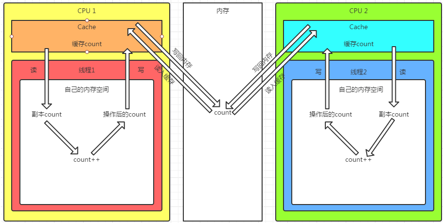
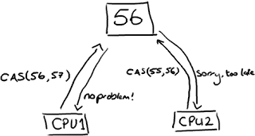
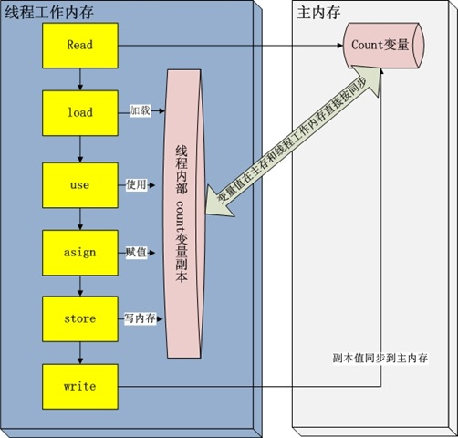

 

 
#### 基础知识 ####

第一次与volatile相识，是在单例模式的介绍中，一个DCL的单例，是如何因为非原子性操作而导致在多线程环境下破坏了单例的唯一性。volatile就在此时挺身而出，搞得人对之好感满满。于此时，我又认识到了锁、同步、原子性，这些概念，下面做一个简单的基础知识科普。 

##### 为什么需要锁 #####

由上图，两颗CPU都在修改内存的变量，导致其计数有误。

##### 锁(lock) #####
锁是用来做并发最简单的方式，当然其代价也是最高的。`内核态的锁`的时候需要操作系统进行一次上下文切换，加锁、释放锁会导致比较多的上下文切换和调度延时，等待锁的线程会被挂起直至锁释放。在上下文切换的时候，cpu之前缓存的指令和数据都将失效，对性能有很大的损失。`用户态的锁`避免了这些问题，但是他们只是在没有真实的竞争时才有效。 

JDK之前，都是靠synchronized关键字保证同步的，这种通过使用一致的锁定协议来协调对共享状态的访问，可以确保无论哪个线程持有守护变量的锁，都采用`独占的方式`来访问这些变量，如果出现多个线程同时访问锁，一些线程将被挂起，必须等待其他线程执行完他们的时间片以后才能被调度执行，在挂起和恢复执行过程中存在着很大的开销。锁还存在着其它的一些缺点，当一个线程正在等待锁时，它不能做任何事。如果一个线程在持有锁的情况下被延迟执行，那么所有需要这个锁的线程都无法执行下去。如果被阻塞的线程优先级高，而持有锁的线程优先级低，将会导致优先级反转。

###### 悲观锁 ######

独占锁是一种悲观锁，synchronized就是一种独占锁，他假设最坏的情况，并且只有在确保其他线程不会造成干扰的情况下执行，会导致其他所有需要锁的线程挂起，等待持有锁的线程释放锁。

###### 乐观锁 ######

比悲观锁更加有效，每次不加锁而是假设没有冲突而去完成某项操作，如果冲突失败就重试，直到成功为止。
CAS乐观锁算法如图：
CAS比较与交换的伪代码可以表示为：

	do{
	备份旧数据
	基于旧数据构造新数据
	}while(!CAS(内存地址，备份的旧数据，新数据))

##### 原子操作(atomic operations) #####

- 所有的原始类型的赋值，long和double除外；
- 所有引用的赋值；
- 所有java.concurrent.Atomic*中类中的操作
- 所有volatile修饰的long和double

为什么long型赋值不是原子操作呢？

事实上java会分两步写入这个long变量，先写32位，再写后32位。这样就线程不安全了。如果改成下面的就线程安全了：
	
	private volatile long foo;

因为volatile内部已经做了synchronized.

##### 线程与内存的交互 #####

每一个线程运行时都有一个线程栈，线程栈保存了线程运行时候变量值信息。当线程访问某一个对象的值的时候，首先通过对象的引用找到对应在堆内存的变量的值，然后把堆内存变量的具体值load到线程本地内存中，建立一个变量副本，之后线程就不再和对象在堆内存变量值有任何关系，而是直接修改副本变量的值，在修改完之后的某一个时刻，自动把线程变量副本的值回写到对象在堆中的变量。如图：

其中use and assign 可以多次出现

##### volatile #####

volatile，声明其修饰的字段易变（可能被多个线程使用），Java内存模型负责各个线程的工作区与主存区的该字段的值保持同步。 
volatile的同步，不同于synchronized，前者是内存同步，后者不仅包含内存同步，并且保证线程互斥。 
volatile能替代简单的锁，却不能保证原子性。 

##### 内存屏障-Memory Barrier #####

内存屏障是一个CPU指令。
1.  确保一些特定操作执行的顺序；
2.  影响一些数据的可见性(可能是某些指令执行后的结果)。编译器和CPU可以在保证输出结果一样的情况下对指令重排序，使性能得到优化。插入一个内存屏障，相当于告诉CPU和编译器先于这个命令的必须先执行，后于这个命令的必须后执行。内存屏障的另一个作用是强制更新一次不同CPU的缓存。例如，一个写屏障会把这个屏障前写入的数据刷新到缓存，这样任何试图读取该数据的线程都将得到最新值，而不用考虑到底是被哪个CPU核心或者哪颗CPU执行的。

 

如果你的字段是volatile，java内存模型将在写操作后插入一个写屏障指令，在读操作前插入一个读屏障指令。 

由`线程和内存交互的图`，可得：

	[读屏障指令] - read - load - use - asign - store - write - [写屏障指令].
 
可以看到，从load到store是不安全的，这期间，如果别的CPU修改了值，将会丢失。因此，我们说`volatile不能保证原子性。`这同时说明：`volatile不能用在getAndOperate场合，仅仅set/get场景是适合volatile的`。

#### voaltile 使用场景及模式 ####
	
	要始终牢记使用volatile的限制——只有在状态真正独立于程序内其他内容时才能使用volatile——这条规则能够避免将这些模式扩展到不安全的用例。 
	 
	Always keep in mind the rules about the limits of where volatile can be used -- only use volatile for state that is truly independent of everything else in your program -- and this should keep you from trying to extend these patterns into dangerous territory.

##### 模式1：状态标志 #####

也许实现volatile变量的规范使用仅仅是使用一个布尔状态标志，用于指示发生了一个重要的一次性事件，例如完成初始化或请求停机。很多应用程序包含了一种控制结构，形式为“在还没有准备好停止程序时再执行一些工作”。
	
	volatile boolean shutdownRequested;
	
	...
	
	public void shutdown() { shutdownRequested = true; }
	
	public void doWork() { 
	    while (!shutdownRequested) { 
	        // do stuff
	    }
	}

这种类型的状态标记的一个公共特性是：通常只有一种状态转换；shutdownRequest标志从false转换为true，然后程序停止。这种模式可以扩展到来回转换的状态标志，但是只有在转换周期不被察觉的情况下才能扩展。

##### 模式2：一次性安全发布(one time safe publication) #####

缺乏同步会导致无法实现可见性，这使得确定何时写入对象引用而不是原语值变得更加困难。在缺乏同步的情况下，可能会遇到某个对象引用的更新值和该对象状态的旧值同时存在。这就是造成著名的双重检查锁定(double checked locking)问题的根源，其中对象引用在没有同步的情况下进行读操作，产生的问题是您可能会看到一个更新的引用，但是仍然会通过该引用看到不完全构造的对象。

实现安全发布对象的一种技术就是将对象引用定义为volatile类型。
	
	public class BackgroundFloobleLoader {
	    public volatile Flooble theFlooble;
	    public void initInBackground() {
	        // do lots of stuff
	        theFlooble = new Flooble();  // this is the only write to theFlooble
	    }
	}
	
	public class SomeOtherClass {
	    public void doWork() {
	        while (true) { 
	            // do some stuff...
	            // use the Flooble, but only if it is ready
	            if (floobleLoader.theFlooble != null) 
	                doSomething(floobleLoader.theFlooble);
	        }
	    }
	}

该模式的一个必要条件是：被发布的对象必须是线程安全的，或者是有效的不可变对象(有效不可变意味着对象的状态在发布之后永远不会被修改)。volatile类型的引用可以确保对象的发布形式的可见性，但是如果对象的状态在发布后将发生更改，那么就需要额外的同步。

##### 模式3：独立观察(independent observation) #####

安全使用volatile的另一种简单模式是：定期“发布”观察结果供程序内部使用。例如：假设有一种环境传感器能够感觉环境温度。一个后台线程可能会每隔几秒读取一次该传感器，并更新包含当前文档的volatile变量。然后，其他线程可以读取这个变量，从而随时能够看到最新的温度值。
	
	public class UserManager {
	    public volatile String lastUser;
	
	    public boolean authenticate(String user, String password) {
	        boolean valid = passwordIsValid(user, password);
	        if (valid) {
	            User u = new User();
	            activeUsers.add(u);
	            lastUser = user;
	        }
	        return valid;
	    }
	}

该模式是一次性安全发布的扩展，将某个值发布，以在程序内的其他地方使用，但是这与一次性事件的发布不同，这是一系列独立事件。这个模式要求被发布的值是有效不可变的——即值的状态在发布后不会更改。使用该值的代码需要清除该值可能随时发生变化。

##### 模式4：volatile bean 模式 #####

volatile bean模式适用于将JavaBeans作为“荣誉结构”使用的框架。在volatile bean模式中，JavaBean被用作一组具有getter/setter方法的独立属性的容器。volatile bean 模式的基本原理是：很多框架为易变数据的持有者(例如HttpSession)提供了容器，但是放入这些容器中的对象必须是线程安全的。 
在volatile bean模式中，JavaBean的所有数据成员都是volatile类型的，并且getter/setter方法必须非常普通——除了获取或设置相应的属性外，不能包含任何逻辑。此外，对于对象引用的数据成员，引用的对象必须是有效不可变的。(这将禁止具有数组值的属性，因为当数组引用被声明为volatile时，只有引用而不是数组本身具有volatile语义)。对于任何volatile变量，不变式或约束都不能包含JavaBean属性。

	@ThreadSafe
	public class Person {
	    private volatile String firstName;
	    private volatile String lastName;
	    private volatile int age;
	
	    public String getFirstName() { return firstName; }
	    public String getLastName() { return lastName; }
	    public int getAge() { return age; }
	
	    public void setFirstName(String firstName) { 
	        this.firstName = firstName;
	    }
	
	    public void setLastName(String lastName) { 
	        this.lastName = lastName;
	    }
	
	    public void setAge(int age) { 
	        this.age = age;
	    }
	}

##### 模式5：volatile 高级模式，开销较低的读-写锁策略 #####

如果读操作远远超过写操作，您可以结合使用内部锁和volatile变量来减少公共代码路径的开销。

	@ThreadSafe
	public class CheesyCounter {
	    // Employs the cheap read-write lock trick
	    // All mutative operations MUST be done with the 'this' lock held
	    @GuardedBy("this") private volatile int value;
	
	    public int getValue() { return value; }
	
	    public synchronized int increment() {
	        return value++;
	    }
	}

上述中显示的线程安全的计数器使用synchronized确保增量操作是原子的，并使用volatile保证当前结果的可见性。如果更新不频繁的话，该方法可实现更好的性能，因为读路径的开销仅仅涉及volatile读操作，这通常要优于一个无竞争的锁获取的开销。

#### voaltile 与 static ####

volatile，声明这个字段易变(可能被多个线程使用)，java内存模型负责各个线程的工作区与主存区的该字段的值保持同步，即一致性；强调变量值的唯一性；

static，声明这个字段是静态的(可能被多个实例共享)，在主存区上该类的所有实例的该字段为同一个变量，即唯一性；强调变量的唯一性。

 